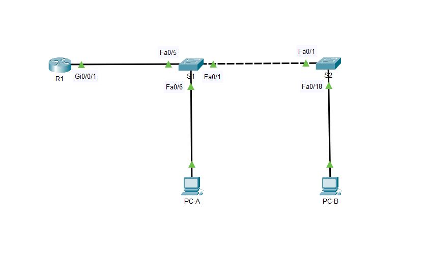

# Configure Router-on-a-Stick Inter-VLAN Routing



Таблица адресации

| Устройство | Интерфейс | IP-адрес      | Маска подсети          | Основной шлюз |
|-------------------|-----------|---------------|------------------------|-------------------|
| R1 | G0/0/1.3 | 192.168.3.1 | 255.255.255.0 | N/A |
|    | G0/0/1.4  | 192.168.4.1 | 255.255.255.0 | N/A |
|    | G0/0/1.8 | N/A | N/A | N/A |
| S1         | VLAN 3    | 192.168.3.11 | 255.255.255.0 | 192.168.3.1 |
| S2         | VLAN 3    | 192.168.3.12 | 255.255.255.0 | 192.168.3.1 |
| PC-A       | NIC       | 192.168.3.3  | 255.255.255.0 | 192.168.3.1   |
| PC-B       | NIC       | 192.168.4.3  | 255.255.255.0 | 192.168.4.1   |

Таблица VLAN'ов в соответствии с нашей топологией

| VLAN | Имя        | Назначенный интерфейс                                        |
| ---- | ---------- | ------------------------------------------------------------ |
| 3    | Management | S1: VLAN 3 <br />S2: VLAN 3 <br />S1: F0/6                   |
| 4    | Operations | S2: F0/18                                                    |
| 7    | ParkingLot | S1: F0/2-4, F0/7-24, G0/1-2<br/>S2: F0/2-17, F0/19-24, G0/1-2 |
| 8    | Native     | N/A                                                          |

### Построим сеть и настроим оборудование согласно условиям

Войдём в привелигированный режим командой ``enable``. Далее перейдём в режим кофигурирования при помощи команды ``configure terminal``. Присвоим устройству имя командой ``hostname %%name%%``. Отключим DNS lookup, чтобы устройство при ввод е некорректных комманд не пыталось найти устройство с таким именем в сети, это делается командой ``no ip domain-lookup``. Установим пароль на привелигированный режим: ``enable secret class``.  

Установим пароль на доступ к консольному режиму:

```
S1(config)#line con 0
S1(config-line)#password cisco
S1(config-line)#login
```

Как мы можем убедиться, данный пароль хранится в открытом виде в файле конфигурации.

```
!
line con 0
 password cisco
 login
!
```

Зашифруем его командой ``password-encryption``. Теперь эта часть конфига выглядит так:

```
!
line con 0
 password 7 0822455D0A16
 login
!
```

При помощи команды ``banner motd`` создадим предупреждение при входе о том что вход воспрещён неавтризованным пользователям. Выставим время на устройстве: ``clock set 14:12:00 9 jul 2020``. Сохраним наши настройки на всех устройствах командой ``copy running-config startup-config``

Настроим VLAN'ы и SVI на коммутаторе S1 согласно условиям. Назначим на порты VLAN'ы.

```
S1#conf t
S1(config)#vlan 3
S1(config-vlan)#name Management
S1(config-vlan)#vlan 4
S1(config-vlan)#name Operations
S1(config-vlan)#vlan 7
S1(config-vlan)#name ParkingLot
S1(config-vlan)#exit
S1(config)#int vlan 3
S1(config-if)#ip address 192.168.3.12 255.255.255.0

%LINK-5-CHANGED: Interface Vlan3, changed state to up

S1(config-if)#exit
S1(config)#ip default-gateway 192.168.3.1
S1(config)#int f0/6
S1(config-if)#switchport mode access 
S1(config-if)#switchport access vlan 3

%LINEPROTO-5-UPDOWN: Line protocol on Interface Vlan3, changed state to up

S1(config-if)#exit
S1(config)#interface range f0/2-4, f0/7-24, g0/1-2
S1(config-if-range)#switchport access vlan 7
S2(config-if-range)#shutdown
```

Аналогичным образом настраиваем S2

```
Switch#conf t
Enter configuration commands, one per line.  End with CNTL/Z.
Switch(config)#hostname S2
S2(config)#vlan 3
S2(config-vlan)#name Management
S2(config-vlan)#vlan 4
S2(config-vlan)#name Operations
S2(config-vlan)#vlan 7
S2(config-vlan)#name ParkingLot
S2(config-vlan)#exit
S2(config)#int vlan 3

%LINK-5-CHANGED: Interface Vlan3, changed state to up

S2(config-if)#ip address 192.168.3.12 255.255.255.0
S2(config-if)#exit
S2(config)#ip default-gateway 192.168.3.1
S2(config)#int range f0/2-17, f0/19-24, g0/1-2
S2(config-if-range)#switchport access vlan 7
S2(config-if-range)#shutdown
S2(config-if-range)#exit
S2(config)#int f0/18
S2(config-if)#switchport mode access 
S2(config-if)#switchport access vlan 4
```

Проверим корректность настроек

```
S1#show vlan brief

VLAN Name                             Status    Ports
---- -------------------------------- --------- -------------------------------
1    default                          active    Fa0/1, Fa0/5
3    Management                       active    Fa0/6
4    Operations                       active    
7    ParkingLot                       active    Fa0/2, Fa0/3, Fa0/4, Fa0/7
                                                Fa0/8, Fa0/9, Fa0/10, Fa0/11
                                                Fa0/12, Fa0/13, Fa0/14, Fa0/15
                                                Fa0/16, Fa0/17, Fa0/18, Fa0/19
                                                Fa0/20, Fa0/21, Fa0/22, Fa0/23
                                                Fa0/24, Gig0/1, Gig0/2
1002 fddi-default                     active    
1003 token-ring-default               active    
1004 fddinet-default                  active    
1005 trnet-default                    active
```

```
S2#show vlan brief

VLAN Name                             Status    Ports
---- -------------------------------- --------- -------------------------------
1    default                          active    Fa0/1
3    Management                       active    
4    Operations                       active    Fa0/18
7    ParkingLot                       active    Fa0/2, Fa0/3, Fa0/4, Fa0/5
                                                Fa0/6, Fa0/7, Fa0/8, Fa0/9
                                                Fa0/10, Fa0/11, Fa0/12, Fa0/13
                                                Fa0/14, Fa0/15, Fa0/16, Fa0/17
                                                Fa0/19, Fa0/20, Fa0/21, Fa0/22
                                                Fa0/23, Fa0/24, Gig0/1, Gig0/2
1002 fddi-default                     active    
1003 token-ring-default               active    
1004 fddinet-default                  active    
1005 trnet-default                    active  
```

На данный момент всё соответствует условиям.

### Настроим  транк между коммутаторами

Переведём интерфейс Fa0/1 на обоих коммутаторах в режим транка и укажем на нём 8 VLAN в качесте native VLAN. Также укажем номера VLAN'ов, которым можно проходить через данный интерфейс.

```
S1(config)#int f0/1
S1(config-if)#switchport mode trunk 
S1(config-if)#switchport trunk native vlan 8
S1(config-if)#switchport trunk allowed vlan 3,4,8
```

```
S2(config)#int fa0/1

%LINEPROTO-5-UPDOWN: Line protocol on Interface FastEthernet0/1, changed state to down

%LINEPROTO-5-UPDOWN: Line protocol on Interface FastEthernet0/1, changed state to up

S2(config-if)#switchport mode trunk
S2(config-if)#switchport trunk native vlan 8
S1(config-if)#switchport trunk allowed vlan 3,4,8
```

Проверим настройки наших транков на обоих коммутаторах.

```
S1#show interfaces trunk
Port        Mode         Encapsulation  Status        Native vlan
Fa0/1       on           802.1q         trunking      8

Port        Vlans allowed on trunk
Fa0/1       3-4,8

Port        Vlans allowed and active in management domain
Fa0/1       3,4

Port        Vlans in spanning tree forwarding state and not pruned
Fa0/1       3,4
```

```
S2#show interfaces trunk
Port        Mode         Encapsulation  Status        Native vlan
Fa0/1       on           802.1q         trunking      8

Port        Vlans allowed on trunk
Fa0/1       3-4,8

Port        Vlans allowed and active in management domain
Fa0/1       3,4

Port        Vlans in spanning tree forwarding state and not pruned
Fa0/1       3,4
```

Переведём Fa0/5 на S1 в режиме транка и разрешим проходить через него тем же VLAN'ам.

```
S1(config)#int f0/5
S1(config-if)#switchport mode trunk
S1(config-if)#switchport trunk allowed vlan 3,4,8
S1(config-if)#switchport trunk native vlan 8
```

Fa0/5 не появился в списке портов выводимых командой ``show interfaces trunk``, т. к. интерфейс отключен со стороны маршрутизатора R1 и находится в состоянии down.

### Настроим маршрутизацию между VLAN'ами в нашей сети

Настроим наш маршрутизатор:

```
Router#conf t
Enter configuration commands, one per line.  End with CNTL/Z.
Router(config)#hostname R1
R1(config)#int G0/0/1
R1(config-if)#no shutdown

%LINK-5-CHANGED: Interface GigabitEthernet0/0/1, changed state to up

%LINEPROTO-5-UPDOWN: Line protocol on Interface GigabitEthernet0/0/1, changed state to up
	
R1(config-if)#exit
R1(config)#int G0/0/1.3

%LINK-5-CHANGED: Interface GigabitEthernet0/0/1.3, changed state to up
%LINEPROTO-5-UPDOWN: Line protocol on Interface GigabitEthernet0/0/1.3, changed state to up

R1(config-subif)#encapsulation ?
  dot1Q  IEEE 802.1Q Virtual LAN
R1(config-subif)#encapsulation dot1Q 3
R1(config-subif)#ip address 192.168.3.1 255.255.255.0
R1(config-subif)#int G0/0/1.4

%LINK-5-CHANGED: Interface GigabitEthernet0/0/1.4, changed state to up
%LINEPROTO-5-UPDOWN: Line protocol on Interface GigabitEthernet0/0/1.4, changed state to up

R1(config-subif)#encapsulation dot1Q 4
R1(config-subif)#ip address 192.168.4.1 255.255.255.0
R1(config-subif)#int G0/0/1.8

%LINK-5-CHANGED: Interface GigabitEthernet0/0/1.8, changed state to up
%LINEPROTO-5-UPDOWN: Line protocol on Interface GigabitEthernet0/0/1.8, changed state to up

R1(config-subif)#encapsulation dot1Q 8
```

Проверим настройки

```
R1#show ip interface brief 

Interface              IP-Address      OK? Method Status                Protocol 
GigabitEthernet0/0/0   unassigned      YES unset  administratively down down 
GigabitEthernet0/0/1   unassigned      YES unset  up                    up 
GigabitEthernet0/0/1.3 192.168.3.1     YES manual up                    up 
GigabitEthernet0/0/1.4 192.168.4.1     YES manual up                    up 
GigabitEthernet0/0/1.8 unassigned      YES unset  up                    up 
Vlan1                  unassigned      YES unset  administratively down down
```

### Удостоверимся что маршрутизация между VLAN'ами работает

С PC-A до шлюза на R1

```
C:\>ping 192.168.3.1

Pinging 192.168.3.1 with 32 bytes of data:

Reply from 192.168.3.1: bytes=32 time=1ms TTL=255
Reply from 192.168.3.1: bytes=32 time<1ms TTL=255
Reply from 192.168.3.1: bytes=32 time<1ms TTL=255
Reply from 192.168.3.1: bytes=32 time<1ms TTL=255

Ping statistics for 192.168.3.1:
    Packets: Sent = 4, Received = 4, Lost = 0 (0% loss),
Approximate round trip times in milli-seconds:
    Minimum = 0ms, Maximum = 1ms, Average = 0ms
```

С PC-A до PC-B

```
C:\>ping 192.168.4.3

Pinging 192.168.4.3 with 32 bytes of data:

Request timed out.
Reply from 192.168.4.3: bytes=32 time<1ms TTL=127
Reply from 192.168.4.3: bytes=32 time<1ms TTL=127
Reply from 192.168.4.3: bytes=32 time<1ms TTL=127

Ping statistics for 192.168.4.3:
    Packets: Sent = 4, Received = 3, Lost = 1 (25% loss),
Approximate round trip times in milli-seconds:
    Minimum = 0ms, Maximum = 0ms, Average = 0ms
```

С PC-A до S2

```
C:\>ping 192.168.3.12

Pinging 192.168.3.12 with 32 bytes of data:

Request timed out.
Reply from 192.168.3.12: bytes=32 time<1ms TTL=255
Reply from 192.168.3.12: bytes=32 time<1ms TTL=255
Reply from 192.168.3.12: bytes=32 time<1ms TTL=255

Ping statistics for 192.168.3.12:
    Packets: Sent = 4, Received = 3, Lost = 1 (25% loss),
Approximate round trip times in milli-seconds:
    Minimum = 0ms, Maximum = 0ms, Average = 0ms
```

Выполним трассировку с PC-B до PC-A

```
C:\>tracert 192.168.3.3

Tracing route to 192.168.3.3 over a maximum of 30 hops: 

  1   0 ms      0 ms      0 ms      192.168.4.1
  2   0 ms      0 ms      0 ms      192.168.3.3

Trace complete.
```

Видим что всё работает корректно, сначала пакет уходит на шлюз по умолчанию, перенаправляется в другой VLAN и доходит до PC-A.

### Лабораторная работа выполнена с использованием Cisco Paket Tracer 7.3.0

1. [Лабораторная работа по теме "Configure Router-on-a-Stick Inter-VLAN Routing"](1.vtp_dtp.pkt).

