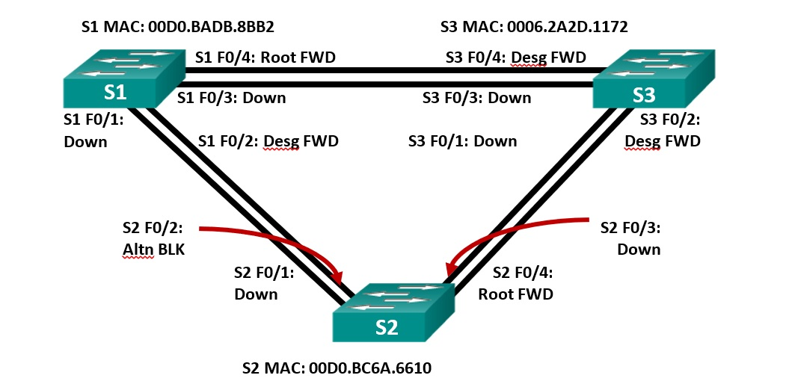

## Создание и настройка основных параметров устройства

### Создание сети и настройка основных параметров устройства

Настроим базовые параметры каждого коммутатора. Поочерёдно вводим комманды:

```
enable
configure terminal
no ip domain-lookup
enable password class
line console 0
password cisco
login
logging synchronous
exit
banner motd #Unauthorized access denied#
interface vlan 1
ip address 192.168.1.2 255.255.255.0
no shutdown
exit
exit
copy running-config startup-config
```

Проверяем связь пингом:

```
S1>ping 192.168.1.2

Type escape sequence to abort.
Sending 5, 100-byte ICMP Echos to 192.168.1.2, timeout is 2 seconds:
!!!!!
Success rate is 100 percent (5/5), round-trip min/avg/max = 0/0/3 ms

S1>ping 192.168.1.3

Type escape sequence to abort.
Sending 5, 100-byte ICMP Echos to 192.168.1.3, timeout is 2 seconds:
!!!!!
Success rate is 100 percent (5/5), round-trip min/avg/max = 0/0/2 ms

S2>ping 192.168.1.3

Type escape sequence to abort.
Sending 5, 100-byte ICMP Echos to 192.168.1.3, timeout is 2 seconds:
!!!!!
Success rate is 100 percent (5/5), round-trip min/avg/max = 0/2/12 ms
```
### Определение корневого моста

Отключим все порты на коммутаторах и настроим подключенные порты в качестве транковых:

```
interface range f0/1-4
shutdown
switchport mode trunk
exit
interface range f0/2, f0/4
no shutdown
exit
exit
show spanning-tree
```
Поочерёдный вывод на всех коммутаторах:

```
S1#show spanning-tree 
VLAN0001
  Spanning tree enabled protocol ieee
  Root ID    Priority    32769
             Address     0006.2A2D.1172
             Cost        19
             Port        4(FastEthernet0/4)
             Hello Time  2 sec  Max Age 20 sec  Forward Delay 15 sec

  Bridge ID  Priority    32769  (priority 32768 sys-id-ext 1)
             Address     00D0.BADB.8BB2
             Hello Time  2 sec  Max Age 20 sec  Forward Delay 15 sec
             Aging Time  20

Interface        Role Sts Cost      Prio.Nbr Type
---------------- ---- --- --------- -------- --------------------------------
Fa0/2            Desg FWD 19        128.2    P2p
Fa0/4            Root FWD 19        128.4    P2p
```
```
S2#show spanning-tree
VLAN0001
  Spanning tree enabled protocol ieee
  Root ID    Priority    32769
             Address     0006.2A2D.1172
             Cost        19
             Port        4(FastEthernet0/4)
             Hello Time  2 sec  Max Age 20 sec  Forward Delay 15 sec

  Bridge ID  Priority    32769  (priority 32768 sys-id-ext 1)
             Address     00D0.BC6A.6610
             Hello Time  2 sec  Max Age 20 sec  Forward Delay 15 sec
             Aging Time  20

Interface        Role Sts Cost      Prio.Nbr Type
---------------- ---- --- --------- -------- --------------------------------
Fa0/2            Altn BLK 19        128.2    P2p
Fa0/4            Root FWD 19        128.4    P2p
```
```
S3#show spanning-tree
VLAN0001
  Spanning tree enabled protocol ieee
  Root ID    Priority    32769
             Address     0006.2A2D.1172
             This bridge is the root
             Hello Time  2 sec  Max Age 20 sec  Forward Delay 15 sec

  Bridge ID  Priority    32769  (priority 32768 sys-id-ext 1)
             Address     0006.2A2D.1172
             Hello Time  2 sec  Max Age 20 sec  Forward Delay 15 sec
             Aging Time  20

Interface        Role Sts Cost      Prio.Nbr Type
---------------- ---- --- --------- -------- --------------------------------
Fa0/4            Desg FWD 19        128.4    P2p
Fa0/2            Desg FWD 19        128.2    P2p
```
Топология сети:



Ответы на вопросы:  
Какой коммутатор является корневым мостом?  
S3  
Почему этот коммутатор был выбран протоколом spanning-tree в качестве корневого моста?  
Корневым мостом становится коммутатор с наименьшим Bridge ID, т. к. приоритет по умолчанию у всех коммутаторов одинаковый (32769), выбран коммутатор с наименьшим MAC-адресом.  
Какие порты на коммутаторе являются корневыми портами?   
В сторону корневого коммутатора (с наименьшей стоимостью пути до корневого коммутатора)  
Какие порты на коммутаторе являются назначенными портами?  
Некорневой порт моста между сегментами сети, принимающий трафик из соответствующего сегмента. В каждом сегменте сети может быть только один назначенный порт.  
Какой порт отображается в качестве альтернативного и в настоящее время заблокирован?  
S2 F0/2  
Почему протокол spanning-tree выбрал этот порт в качестве невыделенного (заблокированного) порта?  
Стоимость портов (определяется скоростью) на S1 и S2 одинаковая (приоритет портов опредяется порядковым номером), но коммутатор S2 имеет наименьший Bridge ID, т. к. имеет самый большой MAC-адрес, следовательно избыточный канал на нём блокируется.  

### Наблюдение за процессом выбора протоколом STP порта, исходя из стоимости портов

Изменим стоимость порта
```
S2(config)#interface f0/4
S2(config-if)#spanning-tree vlan 1 cost 18
```

Посмотрим на изменения протокола spanning-tree
```
S2#show spanning-tree
VLAN0001
  Spanning tree enabled protocol ieee
  Root ID    Priority    32769
             Address     0006.2A2D.1172
             Cost        18
             Port        4(FastEthernet0/4)
             Hello Time  2 sec  Max Age 20 sec  Forward Delay 15 sec

  Bridge ID  Priority    32769  (priority 32768 sys-id-ext 1)
             Address     00D0.BC6A.6610
             Hello Time  2 sec  Max Age 20 sec  Forward Delay 15 sec
             Aging Time  20

Interface        Role Sts Cost      Prio.Nbr Type
---------------- ---- --- --------- -------- --------------------------------
Fa0/2            Desg FWD 19        128.2    P2p
Fa0/4            Root FWD 18        128.4    P2p

S1>show spanning-tree
VLAN0001
  Spanning tree enabled protocol ieee
  Root ID    Priority    32769
             Address     0006.2A2D.1172
             Cost        19
             Port        4(FastEthernet0/4)
             Hello Time  2 sec  Max Age 20 sec  Forward Delay 15 sec

  Bridge ID  Priority    32769  (priority 32768 sys-id-ext 1)
             Address     00D0.BADB.8BB2
             Hello Time  2 sec  Max Age 20 sec  Forward Delay 15 sec
             Aging Time  20

Interface        Role Sts Cost      Prio.Nbr Type
---------------- ---- --- --------- -------- --------------------------------
Fa0/2            Altn BLK 19        128.2    P2p
Fa0/4            Root FWD 19        128.4    P2p
```
Из-за принудительного изменения стоимости на 18 мы сделали порт Fa0/4 на коммутаторе S2 рут портом (порт с самой низкой стоимостью) и следовательно spanning-tree заблокировал порт с наименьшим приоритетом (порядковым номером) на коммутаторе S1.

Удалим изменения стоимости порта
```
S2(config)#interface f0/4
S2(config-if)#no spanning-tree vlan 1 cost 18
```

Проверим
```
S2#show spanning-tree
VLAN0001
  Spanning tree enabled protocol ieee
  Root ID    Priority    32769
             Address     0006.2A2D.1172
             Cost        19
             Port        4(FastEthernet0/4)
             Hello Time  2 sec  Max Age 20 sec  Forward Delay 15 sec

  Bridge ID  Priority    32769  (priority 32768 sys-id-ext 1)
             Address     00D0.BC6A.6610
             Hello Time  2 sec  Max Age 20 sec  Forward Delay 15 sec
             Aging Time  20

Interface        Role Sts Cost      Prio.Nbr Type
---------------- ---- --- --------- -------- --------------------------------
Fa0/2            Altn BLK 19        128.2    P2p
Fa0/4            Root FWD 19        128.4    P2p
```

Видим что конфигурация spanning-tree вернулась к первоначальной.

### Наблюдаем за процессом выбора протоколом STP порта, исходя из приоритета портов

Включим порты Fa0/1 и Fa0/3 на всех коммутаторах и проверим конфигурацию портов в spanning-tree на некорневых коммутаторах.

```
S2#show spanning-tree
VLAN0001
  Spanning tree enabled protocol ieee
  Root ID    Priority    32769
             Address     0006.2A2D.1172
             Cost        19
             Port        3(FastEthernet0/3)
             Hello Time  2 sec  Max Age 20 sec  Forward Delay 15 sec

  Bridge ID  Priority    32769  (priority 32768 sys-id-ext 1)
             Address     00D0.BC6A.6610
             Hello Time  2 sec  Max Age 20 sec  Forward Delay 15 sec
             Aging Time  20

Interface        Role Sts Cost      Prio.Nbr Type
---------------- ---- --- --------- -------- --------------------------------
Fa0/4            Altn BLK 19        128.4    P2p
Fa0/1            Altn BLK 19        128.1    P2p
Fa0/2            Altn BLK 19        128.2    P2p
Fa0/3            Root FWD 19        128.3    P2p

S1#show spanning-tree
VLAN0001
  Spanning tree enabled protocol ieee
  Root ID    Priority    32769
             Address     0006.2A2D.1172
             Cost        19
             Port        3(FastEthernet0/3)
             Hello Time  2 sec  Max Age 20 sec  Forward Delay 15 sec

  Bridge ID  Priority    32769  (priority 32768 sys-id-ext 1)
             Address     00D0.BADB.8BB2
             Hello Time  2 sec  Max Age 20 sec  Forward Delay 15 sec
             Aging Time  20

Interface        Role Sts Cost      Prio.Nbr Type
---------------- ---- --- --------- -------- --------------------------------
Fa0/4            Altn BLK 19        128.4    P2p
Fa0/3            Root FWD 19        128.3    P2p
Fa0/2            Desg FWD 19        128.2    P2p
Fa0/1            Desg FWD 19        128.1    P2p
```
### Ответы на вопросы

В качестве порта корневого моста выбирается порт в сторону корневого моста исходя из стоимости пути (Root Path Cost) и номера порта (Port ID). Как видим, в нашем примере в сторону корневого моста смотрят Fa0/3 и Fa0/4 на обоих некорневых коммутаторах, следовательно выбраны будут с наименьшим номером, что мы и видим.

### Лабораторная работа выполнена с использованием Cisco Paket Tracer 7.3.0

1. [Лабораторная работа по теме "Развертывание коммутируемой сети с резервными каналами"](2.stp.pkt).

