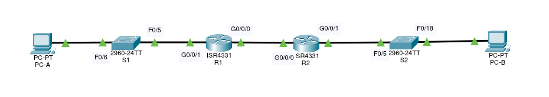

# Implementing DHCPv.4



Адресная таблица
| Устройство | Интерфейс | IP-адрес | Маска подсети | Основной шлюз |
|---|---|---|---|---|
| R1 | G0/0/0  | 10.0.0.1  | 255.255.255.252  | N/A  |
|   | G0/0/1  | N/A  | N/A  |   |
|   | G0/0/1.100  |   |   |   |
|   | G0/0/1.200  |   |   |   |
|   | G0/0/1.1000  | N/A  | N/A  |   |
| R2  | G0/0/0  | 10.0.0.2  | 255.255.255.252  | N/A  |
|   | G0/0/1  |   |   |   |
| S1  | VLAN 200  |   |   |   |
| S2  | VLAN 1  |   |   |   |
| PC-A  | NIC  | DHCP  | DHCP  | DHCP  |
| PC-B  | NIC  | DHCP  | DHCP  | DHCP  |

Таблица VLAN'ов

| VLAN  | Название  | Назначенный интерфейс  |
|---|---|---|
| 1  | N/A  | S2:F0/18  |
| 100  | Clients  | S1:F0/6  |
| 200  | Management  | S1:VLAN 200  |
| 999  | Parking_Lot  | S1:F0/1-4, F0/7-24, G0/1-2  |
| 1000  | Native  | N/A  |

### Построим сеть и настроим оборудование согласно условиям
Условиями требуется взять сеть 192.168.1.0/24 и разделить её на 3 подсети:
Подсеть А (VLAN 200, будет раздаваться на маршрутизаторе R1 для клиентов) должна содержать 58 хостов. Возьмём подсеть 192.168.1.0/26, тогда хостам мы можем присвоить 62 IP-адреса с 192.168.1.1 до 192.168.1.62. Пропишем IP 192.168.1.1 на интерфейсе G0/0/1.100 маршрутизатора R1. 
```
    R1#conf t
    R1(config)#interface G0/0/1.100
    R1(config-subif)#encapsulation dot1Q 100
    R1(config-subif)#ip address 192.168.1.1 255.255.255.192
    R1(config-subif)#description Clients
```
Прописываем 192.168.1.2 на SVI-интерфейсе VLAN 200 коммутатора S1 а IP 192.168.1.1 укажем шлюзом по умолчанию.
```
    S1#conf t
    S1(config)#interface VLAN 200
    
    %LINK-5-CHANGED: Interface Vlan200, changed state to up
    
    S1(config-if)#ip address 192.168.1.2 255.255.255.192
    S1(config)#ip default-gateway 192.168.1.1
```
Подсеть B (VLAN 1) должна поддерживать 28 хостов, мы берём подсеть 192.168.1.64/27 содержащую 32 хоста с IP 192.168.1.65 - 192.168.1.94. Пропишем IP 192.168.1.65 на интерфейсе G0/0/1.200 маршрутизатора R1. 
```
    R1(config-subif)#int g0/0/1.200
    R1(config-subif)#encapsulation dot1Q 200
    R1(config-subif)#ip address 192.168.1.65 255.255.255.224
    R1(config-subif)#description Management
    R1(config-subif)#int g0/0/1.1000
    R1(config-subif)#encapsulation dot1Q 1000 native
    R1(config-subif)#description Native
```
Прописываем 192.168.1.66 на SVI-интерфейсе VLAN 1 коммутатора S1 а IP 192.168.1.1 укажем шлюзом по умолчанию.
```
    S1(config)#interface VLAN 1
    S1(config-if)#ip address 192.168.1.66 255.255.255.224
```
Подсеть С (VLAN 1) будет содержать 12 хостов, выделим 192.186.1.96/28, где мы можем присвоить 14 IP-адресов с 192.168.0.97 - 192.168.0.110. Пропишем IP 192.168.1.97 на интерфейсе G0/0/1 маршрутизатора R2.
```
    R2(config)#interface G0/0/1
    R2(config-if)#ip address 192.168.1.97 255.255.255.240
```
Теперь нам необходимо настроить маршрутизацию на R2 и прописать статические адреса на интерфейсах G0/0/0 обоих маршрутизаторов.
```
    R2(config)#interface G0/0/0
    R2(config-if)#ip address 10.0.0.2 255.255.255.252

    R1(config)#interface G0/0/0
    R1(config-if)#ip address 10.0.0.1 255.255.255.252
```
Укажем шлюз по умолчанию для R2 (это G0/0/0 на R1):
```
    R2(config)#ip route 0.0.0.0 0.0.0.0 10.0.0.1
```
И для R1 (G0/0/0 на R2):
```
    R1(config)#ip route 0.0.0.0 0.0.0.0 10.0.0.2
```
Проверим правильность настроек: с маршрутизатора R1 пошлём пинг на интерфейс G0/0/1 у R2
```
    R1#ping 192.168.1.97
    Type escape sequence to abort.
    Sending 5, 100-byte ICMP Echos to 192.168.1.97, timeout is 2 seconds:
    !!!!!
    Success rate is 100 percent (5/5), round-trip min/avg/max = 0/0/1 ms
```
Сохраним конфигурацию на обоих роутерах.
```
    R1#copy running-config startup-config
    Destination filename [startup-config]?
    Building configuration...
    [OK]
```
Теперь создадим VLAN'ы на коммутаторе S1
```
    S1(config)#vlan 100
    S1(config-vlan)#name Clients
    S1(config)#vlan 999
    S1(config-vlan)#name Parking_Lot
    S1(config)#vlan 1000
    S1(config-vlan)#name Native
```
Настроим IP-адрес на VLAN 200
```
    S1(config)#vlan 999
    S1(config-vlan)#name Management
    S1(config)#interface vlan 200
    S1(config-if)#ip address 192.168.1.66 255.255.255.224
    S1(config)#ip default-gateway 192.168.1.65
```
Настроим коммутатор S2
```
    S2(config)#int vlan 1  
    S2(config-if)#ip address 192.168.1.98 255.255.255.240
    S2(config-if)#no shutdown
    
    %LINK-5-CHANGED: Interface Vlan1, changed state to up
 
    %LINEPROTO-5-UPDOWN: Line protocol on Interface Vlan1, changed state to up
    
    S2(config)#ip default-gateway 192.168.1.97
```
Согласно условий переведём все неиспользуемые интерфейсы в VLAN 999 и отключим их.
```
    S2(config)#int range f0/1-4, f0/6-17, f0/19-24, g0/1-2
    S2(config-if-range)#switchport access vlan 999
    
    % Access VLAN does not exist. Creating vlan 999
    
    S2(config-if-range)#shutdown
```
На коммутаторе S1 проделаем аналогичную настройку
```
    S1(config)#int range f0/1-4, f0/7-24, g0/1-2
    S1(config-if-range)#switchport access vlan 999
```
Настроим VLAN'ы на интерфейсах коммутаторов в соответствии с нашей таблицей
```
    S2(config)#interface f0/18
    S2(config-if)#switchport mode access
    S2(config-if)#switchport access vlan 1
    S1(config)#interface f0/6
    S1(config-if)#switchport mode access
    S1(config-if)#switchport access vlan 100
```
Проверим настройки
```
    S1#show vlan brief

    VLAN Name                             Status    Ports
    ---- -------------------------------- --------- -------------------------------
    1    default                          active    Fa0/5
    100  Clients                          active    Fa0/6
    200  Management                       active
    999  Parking_Lot                      active    Fa0/1, Fa0/2, Fa0/3, Fa0/4
                                                    Fa0/7, Fa0/8, Fa0/9, Fa0/10
                                                    Fa0/11, Fa0/12, Fa0/13, Fa0/14 
                                                    Fa0/15, Fa0/16, Fa0/17, Fa0/18 
                                                    Fa0/19, Fa0/20, Fa0/21, Fa0/22
                                                    Fa0/23, Fa0/24, Gig0/1, Gig0/2
    1000  Native                          active
    1002  fddi-default                    active
    1003  token-ring-default              active
    1004  fddinet-default                 active
    1005  trnet-default                   active
```
Все интерфейсы принадлежат требуемым условиями VLAN'ам. Интерфейс Fa0/5 находится в 1 VLAN, т. к. это значение по умолчанию и мы никак не сконфигурировали его. 
Сконфигурируем интерфей Fa0/5 на коммутаторе S1. Укажем что порт должен работать в режиме транка и разрешим проходить VLAN'ам 100, 200 и 1000. VLAN 1000 укажем как Native VLAN и сохраним конфигурацию.
```
    S1(config)#int f0/5
    S1(config-if)#switchport mode trunk
    
    %LINEPROTO-5-UPDOWN: Line protocol on Interface FastEthernet0/5, changed state to down
    
    %LINEPROTO-5-UPDOWN: Line protocol on Interface FastEthernet0/5, changed state to up
    
    %LINEPROTO-5-UPDOWN: Line protocol on Interface Vlan200, changed state to up
    
    S1(config-if)#switchport trunk native vlan 1000
    S1(config-if)#switchport trunk allowed vlan 100,200,1000
    S1#copy running-config startup-config
```
Проверим
```
    S1#show interfaces trunk
    
    Port    Mode    Encapsulation    Status    Native    vlan
    Fa0/5   on      802.1q           trunking  1000
      
    Port    Vlans allowed on trunk
    Fa0/5   100,200,1000 
      
    Port    Vlans allowed and active in management domain
    Fa0/5   100,200,1000
    
    Port    Vlans in spanning tree forwarding state and not pruned
    Fa0/5   100,200,1000
```
На данном этапе ПК не смогут получить IP-адреса по DHCP т. к. у нас нет работающего DHCP-сервера в сети.

### Сконфигурируем и проверим два DHCPv4 сервера на R1
DHCPv4 сервер будет обслуживать две подсети: подсеть A и подсеть C.
Настроим DHCPv4 пулы для обслуживаемых подсетей. Исключим из пула по пять первых IP-адресов.
```
    R1(config)#ip dhcp excluded-address 192.168.1.1 192.168.1.5
    R1(config)#ip dhcp excluded-address 192.168.1.97 192.168.1.101
```
Создадим DHCP-пул:
```
    R1(config)#ip dhcp pool Vlan100
```
Укажем поддерживаемую сеть:
```
    R1(dhcp-config)#network 192.168.1.0 255.255.255.192
```
Настроим домен:
```
    R1(dhcp-config)#domain-name ccna-lab.com
```
Настроим шлюз по умолчанию:
```
    R1(dhcp-config)#default-router 192.168.1.1
```
Сконфигурировать параметр ``lease`` в Cisco Packet Tracer нет возможности, т. к. данная настройка не поддерживается эмулятором.

Аналогичным образом создадим и настроим второй DHCP-пул:
```
    R1(config)#ip dhcp pool Vlan1
    R1(dhcp-config)#network 192.168.1.96 255.255.255.240
    R1(dhcp-config)#domain-name ccna-lab.com
    R1(dhcp-config)#default-router 192.168.1.97
```
Проверим настройку DHCPv4 сервера
```
    R1# show ip dhcp pool

    Pool Vlan100 :
    Utilization mark (high/low) : 100 / 0
    Subnet size (first/next) : 0 / 0
    Total addresses : 62
    Leased addresses : 0
    Excluded addresses : 2
    Pending event : none

    1 subnet is currently in the pool
    Current index IP address range Leased/Excluded/Total
    192.168.1.1 192.168.1.1 - 192.168.1.62 0 / 2 / 62
    
    Pool Vlan1 :
    Utilization mark (high/low) : 100 / 0
    Subnet size (first/next) : 0 / 0
    Total addresses : 14
    Leased addresses : 0
    Excluded addresses : 2
    Pending event : none
    
    1 subnet is currently in the pool
    Current index IP address range Leased/Excluded/Total
    192.168.1.97 192.168.1.97 - 192.168.1.110 0 / 2 / 14
```
Проверим дальше:
```
    R1#show ip dhcp binding
    IP address Client-ID/ Lease expiration Type
    Hardware address
    192.168.1.6 0060.3E15.E523 -- Automatic
```
Команда `show ip dhcp server statistics` также не поддерживается эмулятором.
```
    R1#show ip dhcp ?
    binding DHCP address bindings
    conflict DHCP address conflicts
    pool DHCP pools information
    relay Miscellaneous DHCP relay information
```
Заново отправим DHCP request с PC-A:
```
    C:\>ipconfig /renew
    
    IP Address......................: 192.168.1.6
    Subnet Mask.....................: 255.255.255.192
    Default Gateway.................: 192.168.1.1
    DNS Server......................: 0.0.0.0
```
  После выдачи нового IP, проверим командой `ipconfig`:
```
      C:\>ipconfig
      
    FastEthernet0 Connection:(default port)
      
    Link-local IPv6 Address.........: FE80::260:3EFF:FE15:E523
    IP Address......................: 192.168.1.6
    Subnet Mask.....................: 255.255.255.192
    Default Gateway.................: 192.168.1.1
      
    Bluetooth Connection:
      
    Link-local IPv6 Address.........: ::
    IP Address......................: 0.0.0.0
    Subnet Mask.....................: 0.0.0.0
    Default Gateway.................: 0.0.0.0
```
Проверим связность, пропинговав G0/0/1 на R2:
```
    C:\>ping 192.168.1.97
      
    Pinging 192.168.1.97 with 32 bytes of data:
      
    Reply from 192.168.1.97: bytes=32 time=1ms TTL=254
    Reply from 192.168.1.97: bytes=32 time<1ms TTL=254
    Reply from 192.168.1.97: bytes=32 time<1ms TTL=254
    Reply from 192.168.1.97: bytes=32 time<1ms TTL=254
      
    Ping statistics for 192.168.1.97:
    Packets: Sent = 4, Received = 4, Lost = 0 (0% loss),
    Approximate round trip times in milli-seconds:
    Minimum = 0ms, Maximum = 1ms, Average = 0ms
```
Теперь настроим DHCP релей на маршрутизаторе R2, который будет перенаправлять запросы из подсети VLAN 1 на DHCP-сервер на R1:
```
    R2(config)#int g0/0/1
    R2(config-if)#ip helper-address 10.0.0.1
```
В коммандной строке на PC-B выполним команду `ipconfig /renew`:
```
    C:\>ipconfig /renew
      
    IP Address......................: 192.168.1.102
    Subnet Mask.....................: 255.255.255.240
    Default Gateway.................: 192.168.1.97
    DNS Server......................: 0.0.0.0

    C:\>ipconfig
          
        FastEthernet0 Connection:(default port)
          
        Link-local IPv6 Address.........: FE80::20C:85FF:FE38:2745
        IP Address......................: 192.168.1.102
        Subnet Mask.....................: 255.255.255.240
        Default Gateway.................: 192.168.1.97
         
        Bluetooth Connection:
        
        Link-local IPv6 Address.........: ::
        IP Address......................: 0.0.0.0
        Subnet Mask.....................: 0.0.0.0
        Default Gateway.................: 0.0.0.0
```
Проверим связность, пропинговав 192.168.1.1:
```
    C:\>ping 192.168.1.1
      
    Pinging 192.168.1.1 with 32 bytes of data:
      
    Reply from 192.168.1.1: bytes=32 time<1ms TTL=254
    Reply from 192.168.1.1: bytes=32 time<1ms TTL=254
    Reply from 192.168.1.1: bytes=32 time<1ms TTL=254
    Reply from 192.168.1.1: bytes=32 time<1ms TTL=254
      
    Ping statistics for 192.168.1.1:
    Packets: Sent = 4, Received = 4, Lost = 0 (0% loss),
    Approximate round trip times in milli-seconds:
    Minimum = 0ms, Maximum = 0ms, Average = 0ms
```
Проверим на R1:
```
    R1#show ip dhcp binding
    IP address    Client-ID/               Lease expiration          Type
                  Hardware address
    192.168.1.6   0060.3E15.E523           --                        Automatic
    192.168.1.102 000C.8538.2745           --                        Automatic
```

### Лабораторная работа выполнена с использованием Cisco Paket Tracer 7.3.0

1. [Лабораторная работа по теме "Развертывание коммутируемой сети с резервными каналами"](dhcpv4.pkt).

