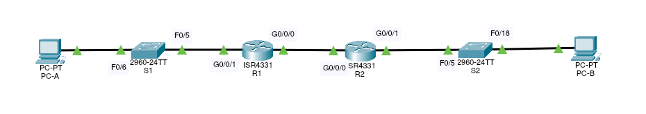

# Implementing DHCPv.6



Адресная таблица
| Устройство | Интерфейс | IPv6 адрес |
|---|---|---|---|---|
| R1 | G0/0/0  | 2001:db8:acad:2::1/64 |
|   |  | fe80::1 |
|   | G0/0/1  | 2001:db8:acad:1::1/64 |
|   |  | fe80::1 |
| R2  | G0/0/0  | 2001:db8:acad:2::2/64 |
|   |  |  fe80::2 |
|   | G0/0/1  | 2001:db8:acad:3::1/64 |
|   |  | fe80::1 |
| PC-A  | NIC  | DHCP  |
| PC-B  | NIC  | DHCP  |


### Построим сеть и настроим оборудование согласно условиям

После первоначальной настройки для каждого маршрутизатора включаем на них IPv6 маршрутизацию (рассылку RA сообщений):
``R2(config)#ipv6 unicast-routing``

### Настроим интерфейсы и маршрутизацию на обоих маршрутизаторах
Настроим IPv6-адреса из таблицы на портах роутера R1.
```
R1(config)#interface G0/0/0
R1(config-if)#ipv6 address 2001:db8:acad:2::1/64
R1(config-if)#interface G0/0/1
R1(config-if)#ipv6 address 2001:db8:acad:1::1/64
```
Теперь произведём подобные настройки на R2.
```
R2(config-if)#interface g0/0/0
R2(config-if)#ipv6 address 2001:db8:acad:2::2/64
R2(config-if)#interface g0/0/1
R2(config-if)#ipv6 address 2001:db8:acad:3::1/64
```
Маршрутом по-умолчанию на роутере R1 укажем порт G0/0/0 на R2.
```
R1(config)#ipv6 route ::/0 2001:db8:acad:3::1
```
Для R2 укажем порт G0/0/0 на R1.
```
R2(config)#ipv6 route ::/0 2001:db8:acad:2::1
```
Проверим связность. С R1 пропингуем G0/0/1 на R2.
```
R1#ping 2001:db8:acad:1::1
  
Type escape sequence to abort.
Sending 5, 100-byte ICMP Echos to 2001:db8:acad:1::1, timeout is 2 seconds:
!!!!!
Success rate is 100 percent (5/5), round-trip min/avg/max = 0/4/12 ms
```
Сохраняем конфигурацию комадой `` copy running-config startup-config`` 

### Проверим работу SLAAC на R1
Мы должны убедится что наш комьютер PC-A получает IPv6-адрес используя SLAAC. На интерфейсе комьютера укажем получение IP-адреса по DHCP, после этого проверим командой ``ipconfig``:
```
C:\>ipconfig
  
FastEthernet0 Connection:(default port)
  
Connection-specific DNS Suffix..:
Link-local IPv6 Address.........: FE80::250:FFF:FEAA:955A
IPv6 Address....................: 2001:DB8:ACAD:1:250:FFF:FEAA:955A
IPv4 Address....................: 0.0.0.0
Subnet Mask.....................: 0.0.0.0
Default Gateway.................: FE80::230:A3FF:FE33:7D02
0.0.0.0
```
Часть IPv6-адреса отвечающая за host-id сгенерирована случайным образом.

### Настроим и проверим работу stateless DHCPv6-сервера на R1
Для проверки работы необходимо чтобы PC-A получил информацию о домене и адрес DNS-сервера от R1. Проверим на PC-A что сейчас указано как DNS-сервер и домен.
```
C:\> ipconfig /all
 
FastEthernet0 Connection:(default port)
  
Connection-specific DNS Suffix..:
Physical Address................: 0050.0FAA.955A
Link-local IPv6 Address.........: FE80::250:FFF:FEAA:955A
IPv6 Address....................: 2001:DB8:ACAD:1:250:FFF:FEAA:955A
IPv4 Address....................: 0.0.0.0
Subnet Mask.....................: 0.0.0.0
Default Gateway.................: FE80::230:A3FF:FE33:7D02
0.0.0.0
DHCP Servers....................: 0.0.0.0
DHCPv6 IAID.....................:
DHCPv6 Client DUID..............: 00-01-00-01-59-92-1C-2C-00-50-0F-AA-95-5A
DNS Servers.....................: ::
0.0.0.0
```
Как видим никаких значений в этих полях нет.
На маршрутизаторе R1 создадим DHCP pool и укажем в нём информацию о DNS-сервере и домене.

```
R1>enable
R1#conf t
Enter configuration commands, one per line. End with CNTL/Z.
R1(config)#ipv6 dhcp pool R1-STATELESS
R1(config-dhcpv6)#dns-server 2001:db8:acad::254
R1(config-dhcpv6)#domain-name STATELESS.com
```
На интерфейсе G0/0/1 командой ``ipv6 nd other-config-flag`` включаем флаг O в RA-сообщениях выходящих с данного интерфейса для того чтобы конечные устройства понимали что у R1 необходимо запросить дополнительную информацию о сети.
```
R1(config)#interface g0/0/1
R1(config-if)#ipv6 nd other-config-flag
R1(config-if)#ipv6 dhcp server R1-STATELESS
```
Перезапустим PC-A и проверим изменились ли получаемые данные о сети.
```
C:\>ipconfig /all
   
FastEthernet0 Connection:(default port)
  
Connection-specific DNS Suffix..: STATELESS.com
Physical Address................: 0050.0FAA.955A
Link-local IPv6 Address.........: FE80::250:FFF:FEAA:955A
IPv6 Address....................: 2001:DB8:ACAD:1:250:FFF:FEAA:955A
IPv4 Address....................: 0.0.0.0
Subnet Mask.....................: 0.0.0.0
Default Gateway.................: FE80::230:A3FF:FE33:7D02
0.0.0.0
DHCP Servers....................: 0.0.0.0
DHCPv6 IAID.....................: 817745811
DHCPv6 Client DUID..............: 00-01-00-01-59-92-1C-2C-00-50-0F-AA-95-5A
DNS Servers.....................: 2001:DB8:ACAD::254
0.0.0.0
```
Как видим настройки получены в полной мере.

### Настроим и проверим работу stateful DHCPv6-сервера на R2
Мы настроим наш stateful DHCPv6-сервер отвечать на DHCPv6-запросы из сети находящейся за маршрутизатором R2. Но Cisco Packet Tracer не позволяет настроить DHCP relay как это требуется условиями лабораторной работы, поэтому мы настроим DHCP stateful сервер на маршрутизаторе R2. 

Проверим что у нас получает по DHCP PC-B в данный момент:
```
C:\>ipconfig /all
  
FastEthernet0 Connection:(default port)
  
Connection-specific DNS Suffix..:
Physical Address................: 00E0.A333.A70D
Link-local IPv6 Address.........: FE80::2E0:A3FF:FE33:A70D
IPv6 Address....................: 2001:DB8:ACAD:3:2E0:A3FF:FE33:A70D
IPv4 Address....................: 0.0.0.0
Subnet Mask.....................: 0.0.0.0
Default Gateway.................: FE80::2E0:8FFF:FE14:EB5
0.0.0.0
DHCP Servers....................: 0.0.0.0
DHCPv6 IAID.....................:
DHCPv6 Client DUID..............: 00-01-00-01-59-92-1C-2C-00-E0-A3-33-A7-0D
DNS Servers.....................: ::
0.0.0.0
```
Настроим на R2 наш DHCP сервер
```
R2(config)# ipv6 dhcp pool R2-STATEFUL
R2(config-dhcp)# address prefix 2001:db8:acad:3:aaa::/80
R2(config-dhcp)# dns-server 2001:db8:acad::254
R2(config-dhcp)# domain-name STATEFUL.com
R2(config-dhcp)# exit
R1(config)# interface g0/0/1
R1(config-if)# ipv6 dhcp server R2-STATEFUL
```
Проверяем его работу на PC-B 
```
C:\>ipconfig /all
  
FastEthernet0 Connection:(default port)
  
Connection-specific DNS Suffix..: STATEFUL.com
Physical Address................: 00E0.A333.A70D
Link-local IPv6 Address.........: FE80::2E0:A3FF:FE33:A70D
IPv6 Address....................: 2001:DB8:ACAD:3:AAA:D969:D275:802D
IPv4 Address....................: 0.0.0.0
Subnet Mask.....................: 0.0.0.0
Default Gateway.................: FE80::2E0:8FFF:FE14:EB5
0.0.0.0
DHCP Servers....................: 0.0.0.0
DHCPv6 IAID.....................: 317471612
DHCPv6 Client DUID..............: 00-01-00-01-59-92-1C-2C-00-E0-A3-33-A7-0D
DNS Servers.....................: 2001:DB8:ACAD::254
0.0.0.0
```
Как видим наш stateful DHCPv6 сервер настроен правильно и отвечает на запросы.
Проверим связность: пропингуем G0/0/1 на R1 с  PC-B
```
C:\>ping 2001:DB8:ACAD:1::1
  
Pinging 2001:DB8:ACAD:1::1 with 32 bytes of data:
  
Reply from 2001:DB8:ACAD:1::1: bytes=32 time=1ms TTL=254
Reply from 2001:DB8:ACAD:1::1: bytes=32 time=2ms TTL=254
Reply from 2001:DB8:ACAD:1::1: bytes=32 time<1ms TTL=254
Reply from 2001:DB8:ACAD:1::1: bytes=32 time<1ms TTL=254
  
Ping statistics for 2001:DB8:ACAD:1::1:
Packets: Sent = 4, Received = 4, Lost = 0 (0% loss),
Approximate round trip times in milli-seconds:
Minimum = 0ms, Maximum = 2ms, Average = 0ms
```


### Лабораторная работа выполнена с использованием Cisco Paket Tracer 7.3.0

1. [Лабораторная работа по теме "Развертывание коммутируемой сети с резервными каналами"](dhcpv6.pkt).
