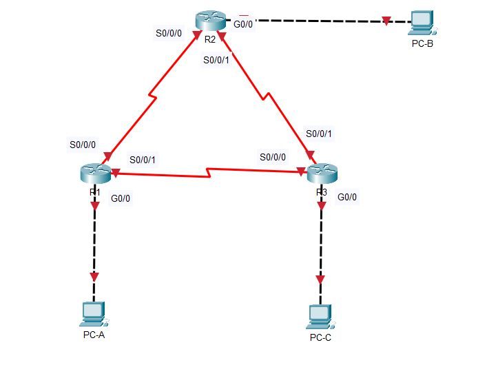

# Настройка базового протокола OSPF для одной области

### Создание сети и настройка основных параметров устройства



Создадим сеть по заданной топологии и сконфигурируем устройства. Проверим связь

```
R1#ping 192.168.12.2

Type escape sequence to abort.
Sending 5, 100-byte ICMP Echos to 192.168.12.2, timeout is 2 seconds:
!!!!!
Success rate is 100 percent (5/5), round-trip min/avg/max = 1/2/6 ms

R1#ping 192.168.13.2

Type escape sequence to abort.
Sending 5, 100-byte ICMP Echos to 192.168.13.2, timeout is 2 seconds:
!!!!!
Success rate is 100 percent (5/5), round-trip min/avg/max = 1/5/21 ms
```

```R2#ping 192.168.12.1
R2#ping 192.168.12.1

Type escape sequence to abort.
Sending 5, 100-byte ICMP Echos to 192.168.12.1, timeout is 2 seconds:
!!!!!
Success rate is 100 percent (5/5), round-trip min/avg/max = 1/3/13 ms

R2#ping 192.168.23.2

Type escape sequence to abort.
Sending 5, 100-byte ICMP Echos to 192.168.23.2, timeout is 2 seconds:
!!!!!
Success rate is 100 percent (5/5), round-trip min/avg/max = 1/4/16 ms
```

Проверим доступность шлюзов с ПК:

```
R3#ping 192.168.23.1

Type escape sequence to abort.
Sending 5, 100-byte ICMP Echos to 192.168.23.1, timeout is 2 seconds:
!!!!!
Success rate is 100 percent (5/5), round-trip min/avg/max = 1/3/11 ms

R3#ping 192.168.13.1

Type escape sequence to abort.
Sending 5, 100-byte ICMP Echos to 192.168.13.1, timeout is 2 seconds:
!!!!!
Success rate is 100 percent (5/5), round-trip min/avg/max = 1/4/16 ms
```

```
C:\>ping 192.168.1.1

Pinging 192.168.1.1 with 32 bytes of data:

Reply from 192.168.1.1: bytes=32 time=1ms TTL=255
Reply from 192.168.1.1: bytes=32 time<1ms TTL=255
Reply from 192.168.1.1: bytes=32 time<1ms TTL=255
Reply from 192.168.1.1: bytes=32 time<1ms TTL=255

Ping statistics for 192.168.1.1:
    Packets: Sent = 4, Received = 4, Lost = 0 (0% loss),
Approximate round trip times in milli-seconds:
    Minimum = 0ms, Maximum = 1ms, Average = 0ms
    
C:\>ping 192.168.2.1

Pinging 192.168.2.1 with 32 bytes of data:

Reply from 192.168.2.1: bytes=32 time=1ms TTL=255
Reply from 192.168.2.1: bytes=32 time<1ms TTL=255
Reply from 192.168.2.1: bytes=32 time<1ms TTL=255
Reply from 192.168.2.1: bytes=32 time<1ms TTL=255

Ping statistics for 192.168.2.1:
    Packets: Sent = 4, Received = 4, Lost = 0 (0% loss),
Approximate round trip times in milli-seconds:
    Minimum = 0ms, Maximum = 1ms, Average = 0ms
    
C:\>ping 192.168.3.1

Pinging 192.168.3.1 with 32 bytes of data:

Reply from 192.168.3.1: bytes=32 time=1ms TTL=255
Reply from 192.168.3.1: bytes=32 time<1ms TTL=255
Reply from 192.168.3.1: bytes=32 time<1ms TTL=255
Reply from 192.168.3.1: bytes=32 time<1ms TTL=255

Ping statistics for 192.168.3.1:
    Packets: Sent = 4, Received = 4, Lost = 0 (0% loss),
Approximate round trip times in milli-seconds:
    Minimum = 0ms, Maximum = 1ms, Average = 0ms
```

Как видим, на все эхо-запросы получены ответы.

### Настройка и проверка маршрутизации OSPF

Настроим протокол OSPF на роутере R1

```
R1#conf t
Enter configuration commands, one per line.  End with CNTL/Z.
R1(config)#router ospf 1
R1(config-router)#network 192.168.1.0 0.0.0.255 area 0
R1(config-router)#network 192.168.12.0 0.0.0.3 area 0
R1(config-router)#network 192.168.13.0 0.0.0.3 area 0
```

Настроим OSPF на роутерах R2 и R3

```
R2#conf t
Enter configuration commands, one per line.  End with CNTL/Z.
R2(config)#router ospf 1
R2(config-router)#do show ip route connected
 C   192.168.2.0/24  is directly connected, GigabitEthernet0/0
 C   192.168.12.0/30  is directly connected, Serial0/0/0
 C   192.168.23.0/30  is directly connected, Serial0/0/1

R2(config-router)#network 192.168.2.0 0.0.0.255 area 0
R2(config-router)#network 192.168.12.0 0.0.0.3 area 0
R2(config-router)#network 192.168.23.0 0.0.0.3 area 0
00:34:39: %OSPF-5-ADJCHG: Process 1, Nbr 192.168.13.1 on Serial0/0/0 from LOADING to FULL, Loading Done
```

```
R3#conf t
Enter configuration commands, one per line.  End with CNTL/Z.
R3(config)#router ospf 1
R3(config-router)#do show ip route connected
 C   192.168.3.0/24  is directly connected, GigabitEthernet0/0
 C   192.168.13.0/30  is directly connected, Serial0/0/0
 C   192.168.23.0/30  is directly connected, Serial0/0/1

R3(config-router)#network 192.168.3.0 0.0.0.255 area 0
R3(config-router)#network 192.168.13.0 0.0.0.3 area 0
R3(config-router)#network 192.168.23.0 0.0.0.3 area 0
00:31:07: %OSPF-5-ADJCHG: Process 1, Nbr 192.168.13.1 on Serial0/0/0 from LOADING to FULL, Loading Done

00:31:13: %OSPF-5-ADJCHG: Process 1, Nbr 192.168.23.1 on Serial0/0/1 from LOADING to FULL, Loading Done
```

Проверим информацию о соседних устройствах и маршрутизации OSPF выполнив команду ``show ip ospf neighbor``

```
R1#show ip ospf neighbor

Neighbor ID     Pri   State           Dead Time   Address         Interface
192.168.23.1      0   FULL/  -        00:00:30    192.168.12.2    Serial0/0/0
192.168.23.2      0   FULL/  -        00:00:35    192.168.13.2    Serial0/0/1
```

```
R2#show ip ospf neighbor 

Neighbor ID     Pri   State           Dead Time   Address         Interface
192.168.23.2      0   FULL/  -        00:00:37    192.168.23.2    Serial0/0/1
192.168.13.1      0   FULL/  -        00:00:34    192.168.12.1    Serial0/0/0
```

```
R3#show ip ospf neighbor 

Neighbor ID     Pri   State           Dead Time   Address         Interface
192.168.13.1      0   FULL/  -        00:00:31    192.168.13.1    Serial0/0/0
192.168.23.1      0   FULL/  -        00:00:37    192.168.23.1    Serial0/0/1
```

```
R1#show ip route
Codes: L - local, C - connected, S - static, R - RIP, M - mobile, B - BGP
       D - EIGRP, EX - EIGRP external, O - OSPF, IA - OSPF inter area
       N1 - OSPF NSSA external type 1, N2 - OSPF NSSA external type 2
       E1 - OSPF external type 1, E2 - OSPF external type 2, E - EGP
       i - IS-IS, L1 - IS-IS level-1, L2 - IS-IS level-2, ia - IS-IS inter area
       * - candidate default, U - per-user static route, o - ODR
       P - periodic downloaded static route

Gateway of last resort is not set

     192.168.1.0/24 is variably subnetted, 2 subnets, 2 masks
C       192.168.1.0/24 is directly connected, GigabitEthernet0/0
L       192.168.1.1/32 is directly connected, GigabitEthernet0/0
O    192.168.2.0/24 [110/65] via 192.168.12.2, 00:09:48, Serial0/0/0
O    192.168.3.0/24 [110/65] via 192.168.13.2, 00:08:23, Serial0/0/1
     192.168.12.0/24 is variably subnetted, 2 subnets, 2 masks
C       192.168.12.0/30 is directly connected, Serial0/0/0
L       192.168.12.1/32 is directly connected, Serial0/0/0
     192.168.13.0/24 is variably subnetted, 2 subnets, 2 masks
C       192.168.13.0/30 is directly connected, Serial0/0/1
L       192.168.13.1/32 is directly connected, Serial0/0/1
     192.168.23.0/30 is subnetted, 1 subnets
O       192.168.23.0/30 [110/128] via 192.168.12.2, 00:08:23, Serial0/0/0
                        [110/128] via 192.168.13.2, 00:08:23, Serial0/0/1
```

```
R2#show ip route
Codes: L - local, C - connected, S - static, R - RIP, M - mobile, B - BGP
       D - EIGRP, EX - EIGRP external, O - OSPF, IA - OSPF inter area
       N1 - OSPF NSSA external type 1, N2 - OSPF NSSA external type 2
       E1 - OSPF external type 1, E2 - OSPF external type 2, E - EGP
       i - IS-IS, L1 - IS-IS level-1, L2 - IS-IS level-2, ia - IS-IS inter area
       * - candidate default, U - per-user static route, o - ODR
       P - periodic downloaded static route

Gateway of last resort is not set

O    192.168.1.0/24 [110/65] via 192.168.12.1, 00:10:14, Serial0/0/0
     192.168.2.0/24 is variably subnetted, 2 subnets, 2 masks
C       192.168.2.0/24 is directly connected, GigabitEthernet0/0
L       192.168.2.1/32 is directly connected, GigabitEthernet0/0
O    192.168.3.0/24 [110/65] via 192.168.23.2, 00:08:34, Serial0/0/1
     192.168.12.0/24 is variably subnetted, 2 subnets, 2 masks
C       192.168.12.0/30 is directly connected, Serial0/0/0
L       192.168.12.2/32 is directly connected, Serial0/0/0
     192.168.13.0/30 is subnetted, 1 subnets
O       192.168.13.0/30 [110/128] via 192.168.12.1, 00:08:34, Serial0/0/0
                        [110/128] via 192.168.23.2, 00:08:34, Serial0/0/1
     192.168.23.0/24 is variably subnetted, 2 subnets, 2 masks
C       192.168.23.0/30 is directly connected, Serial0/0/1
L       192.168.23.1/32 is directly connected, Serial0/0/1
```

```
R3#show ip route
Codes: L - local, C - connected, S - static, R - RIP, M - mobile, B - BGP
       D - EIGRP, EX - EIGRP external, O - OSPF, IA - OSPF inter area
       N1 - OSPF NSSA external type 1, N2 - OSPF NSSA external type 2
       E1 - OSPF external type 1, E2 - OSPF external type 2, E - EGP
       i - IS-IS, L1 - IS-IS level-1, L2 - IS-IS level-2, ia - IS-IS inter area
       * - candidate default, U - per-user static route, o - ODR
       P - periodic downloaded static route

Gateway of last resort is not set

O    192.168.1.0/24 [110/65] via 192.168.13.1, 00:09:10, Serial0/0/0
O    192.168.2.0/24 [110/65] via 192.168.23.1, 00:09:00, Serial0/0/1
     192.168.3.0/24 is variably subnetted, 2 subnets, 2 masks
C       192.168.3.0/24 is directly connected, GigabitEthernet0/0
L       192.168.3.1/32 is directly connected, GigabitEthernet0/0
     192.168.12.0/30 is subnetted, 1 subnets
O       192.168.12.0/30 [110/128] via 192.168.13.1, 00:09:00, Serial0/0/0
                        [110/128] via 192.168.23.1, 00:09:00, Serial0/0/1
     192.168.13.0/24 is variably subnetted, 2 subnets, 2 masks
C       192.168.13.0/30 is directly connected, Serial0/0/0
L       192.168.13.2/32 is directly connected, Serial0/0/0
     192.168.23.0/24 is variably subnetted, 2 subnets, 2 masks
C       192.168.23.0/30 is directly connected, Serial0/0/1
L       192.168.23.2/32 is directly connected, Serial0/0/1
```

Видим что все настроенные сети доступны с любого из маршрутизаторов. Посмотреть в таблице только маршруты OSPF можно командой ``show ip route ospf``

```
R1#show ip route ospf
O    192.168.2.0 [110/65] via 192.168.12.2, 00:15:14, Serial0/0/0
O    192.168.3.0 [110/65] via 192.168.13.2, 00:13:49, Serial0/0/1
     192.168.23.0/30 is subnetted, 1 subnets
O       192.168.23.0 [110/128] via 192.168.12.2, 00:13:49, Serial0/0/0
                     [110/128] via 192.168.13.2, 00:13:49, Serial0/0/1
```

Проверим параметры протокола OSPF командой ``show ip protocols``

```
R1#show ip protocols 

Routing Protocol is "ospf 1"
  Outgoing update filter list for all interfaces is not set 
  Incoming update filter list for all interfaces is not set 
  Router ID 192.168.13.1
  Number of areas in this router is 1. 1 normal 0 stub 0 nssa
  Maximum path: 4
  Routing for Networks:
    192.168.1.0 0.0.0.255 area 0
    192.168.12.0 0.0.0.3 area 0
    192.168.13.0 0.0.0.3 area 0
  Routing Information Sources:  
    Gateway         Distance      Last Update 
    192.168.13.1         110      00:15:09
    192.168.23.1         110      00:15:03
    192.168.23.2         110      00:15:03
  Distance: (default is 110)
```

Проверим данные процесса OSPF командой ``show ip ospf``

```
R1#show ip ospf
 Routing Process "ospf 1" with ID 192.168.13.1
 Supports only single TOS(TOS0) routes
 Supports opaque LSA
 SPF schedule delay 5 secs, Hold time between two SPFs 10 secs
 Minimum LSA interval 5 secs. Minimum LSA arrival 1 secs
 Number of external LSA 0. Checksum Sum 0x000000
 Number of opaque AS LSA 0. Checksum Sum 0x000000
 Number of DCbitless external and opaque AS LSA 0
 Number of DoNotAge external and opaque AS LSA 0
 Number of areas in this router is 1. 1 normal 0 stub 0 nssa
 External flood list length 0
    Area BACKBONE(0)
        Number of interfaces in this area is 3
        Area has no authentication
        SPF algorithm executed 6 times
        Area ranges are
        Number of LSA 3. Checksum Sum 0x00c59a
        Number of opaque link LSA 0. Checksum Sum 0x000000
        Number of DCbitless LSA 0
        Number of indication LSA 0
        Number of DoNotAge LSA 0
        Flood list length 0
```

Команда отображает данные области OSPF, но, к сожалению, время последнего расчёта алгоритма SPF не выводится.

Проверим параметры интерфейса OSPF командой ``show ip ospf interface``, т. к. команда ``show ip ospf interface brief`` не срабатывает в Packet Tracer.

```
R1#show ip ospf interface

GigabitEthernet0/0 is up, line protocol is up
  Internet address is 192.168.1.1/24, Area 0
  Process ID 1, Router ID 192.168.13.1, Network Type BROADCAST, Cost: 1
  Transmit Delay is 1 sec, State DR, Priority 1
  Designated Router (ID) 192.168.13.1, Interface address 192.168.1.1
  No backup designated router on this network
  Timer intervals configured, Hello 10, Dead 40, Wait 40, Retransmit 5
    Hello due in 00:00:07
  Index 1/1, flood queue length 0
  Next 0x0(0)/0x0(0)
  Last flood scan length is 1, maximum is 1
  Last flood scan time is 0 msec, maximum is 0 msec
  Neighbor Count is 0, Adjacent neighbor count is 0
  Suppress hello for 0 neighbor(s)
Serial0/0/0 is up, line protocol is up
  Internet address is 192.168.12.1/30, Area 0
  Process ID 1, Router ID 192.168.13.1, Network Type POINT-TO-POINT, Cost: 64
  Transmit Delay is 1 sec, State POINT-TO-POINT,
  Timer intervals configured, Hello 10, Dead 40, Wait 40, Retransmit 5
    Hello due in 00:00:07
  Index 2/2, flood queue length 0
  Next 0x0(0)/0x0(0)
  Last flood scan length is 1, maximum is 1
  Last flood scan time is 0 msec, maximum is 0 msec
  Neighbor Count is 1 , Adjacent neighbor count is 1
    Adjacent with neighbor 192.168.23.1
  Suppress hello for 0 neighbor(s)
Serial0/0/1 is up, line protocol is up
  Internet address is 192.168.13.1/30, Area 0
  Process ID 1, Router ID 192.168.13.1, Network Type POINT-TO-POINT, Cost: 64
  Transmit Delay is 1 sec, State POINT-TO-POINT,
  Timer intervals configured, Hello 10, Dead 40, Wait 40, Retransmit 5
    Hello due in 00:00:03
  Index 3/3, flood queue length 0
  Next 0x0(0)/0x0(0)
  Last flood scan length is 1, maximum is 1
  Last flood scan time is 0 msec, maximum is 0 msec
  Neighbor Count is 1 , Adjacent neighbor count is 1
    Adjacent with neighbor 192.168.23.2
  Suppress hello for 0 neighbor(s)
```

Проверим наличие сквозного соединения. Все компьютеры должны отправлять запросы и получать ответы ото всех остальных компьютеров приведённых в топологии. Ping с PC-A:

```
C:\>ping 192.168.2.3

Pinging 192.168.2.3 with 32 bytes of data:

Reply from 192.168.2.3: bytes=32 time=2ms TTL=126
Reply from 192.168.2.3: bytes=32 time=1ms TTL=126
Reply from 192.168.2.3: bytes=32 time=1ms TTL=126
Reply from 192.168.2.3: bytes=32 time=1ms TTL=126

Ping statistics for 192.168.2.3:
    Packets: Sent = 4, Received = 4, Lost = 0 (0% loss),
Approximate round trip times in milli-seconds:
    Minimum = 1ms, Maximum = 2ms, Average = 1ms

C:\>ping 192.168.3.3

Pinging 192.168.3.3 with 32 bytes of data:

Reply from 192.168.3.3: bytes=32 time=2ms TTL=126
Reply from 192.168.3.3: bytes=32 time=3ms TTL=126
Reply from 192.168.3.3: bytes=32 time=3ms TTL=126
Reply from 192.168.3.3: bytes=32 time=1ms TTL=126

Ping statistics for 192.168.3.3:
    Packets: Sent = 4, Received = 4, Lost = 0 (0% loss),
Approximate round trip times in milli-seconds:
    Minimum = 1ms, Maximum = 3ms, Average = 2ms
```

Ping с PC-B:

```
C:\>ping 192.168.1.3

Pinging 192.168.1.3 with 32 bytes of data:

Reply from 192.168.1.3: bytes=32 time=2ms TTL=126
Reply from 192.168.1.3: bytes=32 time=4ms TTL=126
Reply from 192.168.1.3: bytes=32 time=6ms TTL=126
Reply from 192.168.1.3: bytes=32 time=1ms TTL=126

Ping statistics for 192.168.1.3:
    Packets: Sent = 4, Received = 4, Lost = 0 (0% loss),
Approximate round trip times in milli-seconds:
    Minimum = 1ms, Maximum = 6ms, Average = 3ms

C:\>ping 192.168.3.3

Pinging 192.168.3.3 with 32 bytes of data:

Reply from 192.168.3.3: bytes=32 time=2ms TTL=126
Reply from 192.168.3.3: bytes=32 time=1ms TTL=126
Reply from 192.168.3.3: bytes=32 time=1ms TTL=126
Reply from 192.168.3.3: bytes=32 time=3ms TTL=126

Ping statistics for 192.168.3.3:
    Packets: Sent = 4, Received = 4, Lost = 0 (0% loss),
Approximate round trip times in milli-seconds:
    Minimum = 1ms, Maximum = 3ms, Average = 1ms
```

Теперь мы убедились что наша сеть работает.

### Изменение назначенных идентификаторов маршрутизаторов

Изменим идентификаторы маршрутизаторов с помощью loopback-адресов. Назначим IP-адрес loopback-интерфейсу 0 для маршрутизатора R1.

```
R1#conf t
Enter configuration commands, one per line.  End with CNTL/Z.
R1(config)#interface lo0

%LINK-5-CHANGED: Interface Loopback0, changed state to up

%LINEPROTO-5-UPDOWN: Line protocol on Interface Loopback0, changed state to up

R1(config-if)#ip address 1.1.1.1 255.255.255.255
R1(config-if)#end

%SYS-5-CONFIG_I: Configured from console by console
```

Аналогичным образом назначим IP адреса для loopback-интерфейсов роутеров R2 и R3. Сохраним конфигурацию и перезагрузим роутеры. Проверим идентификаторы при помощи команды ``show ip protocols``

```
R1>show ip protocols 

Routing Protocol is "ospf 1"
  Outgoing update filter list for all interfaces is not set 
  Incoming update filter list for all interfaces is not set 
  Router ID 1.1.1.1
  Number of areas in this router is 1. 1 normal 0 stub 0 nssa
  Maximum path: 4
  Routing for Networks:
    192.168.1.0 0.0.0.255 area 0
    192.168.12.0 0.0.0.3 area 0
    192.168.13.0 0.0.0.3 area 0
  Routing Information Sources:  
    Gateway         Distance      Last Update 
    1.1.1.1              110      00:00:37
    2.2.2.2              110      00:00:37
    3.3.3.3              110      00:00:37
  Distance: (default is 110)
```

Как видим идентификаторы присвоены в соответствии с назначенными на loopback-интерфейсах IP-адресами.

```
R1>show ip ospf neighbor

Neighbor ID     Pri   State           Dead Time   Address         Interface
2.2.2.2           0   FULL/  -        00:00:33    192.168.12.2    Serial0/0/0
3.3.3.3           0   FULL/  -        00:00:33    192.168.13.2    Serial0/0/1
```

Теперь изменим идентификатор маршрутизатора R1 с помощью команды router-id

```
R1#conf t
Enter configuration commands, one per line.  End with CNTL/Z.
R1(config)#router ospf 1
R1(config-router)#router-id 11.11.11.11
Reload or use "clear ip ospf process" command, for this to take effect
R1(config-router)#end
```

Видим что для применения настройки необходимо либо снова перезагрузить маршрутизаторы, либо воспользоваться командой ``clear ip ospf process``. Настроим на маршрутизаторе R2 идентификатор 22.22.22.22, а на маршрутизаторе R3 33.33.33.33. Затем воспользуемся командой ``clear ip ospf process``.

```
R2#conf t
Enter configuration commands, one per line.  End with CNTL/Z.
R2(config)#router ospf 1
R2(config-router)#router-id 22.22.22.22
R2(config-router)#Reload or use "clear ip ospf process" command, for this to take effect
R2(config-router)#end

%SYS-5-CONFIG_I: Configured from console by console

00:17:37: %OSPF-5-ADJCHG: Process 1, Nbr 33.33.33.33 on Serial0/0/1 from LOADING to FULL, Loading Done

R2#clear ip ospf process 
Reset ALL OSPF processes? [no]: yes

00:17:43: %OSPF-5-ADJCHG: Process 1, Nbr 33.33.33.33 on Serial0/0/1 from FULL to DOWN, Neighbor Down: Adjacency forced to reset

00:17:43: %OSPF-5-ADJCHG: Process 1, Nbr 33.33.33.33 on Serial0/0/1 from FULL to DOWN, Neighbor Down: Interface down or detached

00:17:43: %OSPF-5-ADJCHG: Process 1, Nbr 1.1.1.1 on Serial0/0/0 from FULL to DOWN, Neighbor Down: Adjacency forced to reset

00:17:43: %OSPF-5-ADJCHG: Process 1, Nbr 1.1.1.1 on Serial0/0/0 from FULL to DOWN, Neighbor Down: Interface down or detached

00:17:53: %OSPF-5-ADJCHG: Process 1, Nbr 11.11.11.11 on Serial0/0/0 from LOADING to FULL, Loading Done

00:17:57: %OSPF-5-ADJCHG: Process 1, Nbr 33.33.33.33 on Serial0/0/1 from LOADING to FULL, Loading Done
```

```
R3#conf t
Enter configuration commands, one per line.  End with CNTL/Z.
R3(config)#router ospf 1
R3(config-router)#router-id 33.33.33.33
R3(config-router)#Reload or use "clear ip ospf process" command, for this to take effect

%SYS-5-CONFIG_I: Configured from console by console

R3#clear ip ospf process 
Reset ALL OSPF processes? [no]: yes

00:17:26: %OSPF-5-ADJCHG: Process 1, Nbr 1.1.1.1 on Serial0/0/0 from FULL to DOWN, Neighbor Down: Adjacency forced to reset

00:17:26: %OSPF-5-ADJCHG: Process 1, Nbr 1.1.1.1 on Serial0/0/0 from FULL to DOWN, Neighbor Down: Interface down or detached

00:17:26: %OSPF-5-ADJCHG: Process 1, Nbr 2.2.2.2 on Serial0/0/1 from FULL to DOWN, Neighbor Down: Adjacency forced to reset

00:17:26: %OSPF-5-ADJCHG: Process 1, Nbr 2.2.2.2 on Serial0/0/1 from FULL to DOWN, Neighbor Down: Interface down or detached

00:17:27: %OSPF-5-ADJCHG: Process 1, Nbr 1.1.1.1 on Serial0/0/0 from LOADING to FULL, Loading Done

00:17:30: %OSPF-5-ADJCHG: Process 1, Nbr 2.2.2.2 on Serial0/0/1 from LOADING to FULL, Loading Done

00:17:50: %OSPF-5-ADJCHG: Process 1, Nbr 22.22.22.22 on Serial0/0/1 from LOADING to FULL, Loading Done

00:17:57: %OSPF-5-ADJCHG: Process 1, Nbr 11.11.11.11 on Serial0/0/0 from LOADING to FULL, Loading Done
```

Проверим, изменился ли идентификатор на маршрутизаторе R1.

```
R1#show ip protocols 

Routing Protocol is "ospf 1"
  Outgoing update filter list for all interfaces is not set 
  Incoming update filter list for all interfaces is not set 
  Router ID 11.11.11.11
  Number of areas in this router is 1. 1 normal 0 stub 0 nssa
  Maximum path: 4
  Routing for Networks:
    192.168.1.0 0.0.0.255 area 0
    192.168.12.0 0.0.0.3 area 0
    192.168.13.0 0.0.0.3 area 0
  Routing Information Sources:  
    Gateway         Distance      Last Update 
    1.1.1.1              110      00:03:08
    2.2.2.2              110      00:03:06
    3.3.3.3              110      00:20:11
    11.11.11.11          110      00:02:39
    22.22.22.22          110      00:02:46
    33.33.33.33          110      00:02:39
  Distance: (default is 110)
```

Выполним команду ``show ip ospf neighbor`` на маршрутизаторе R1, чтобы убедиться, что новые идентификаторы для маршрутизаторов R2 и R3 содержатся в списке.

```
R1#show ip ospf neighbor 

Neighbor ID     Pri   State           Dead Time   Address         Interface
22.22.22.22       0   FULL/  -        00:00:36    192.168.12.2    Serial0/0/0
33.33.33.33       0   FULL/  -        00:00:37    192.168.13.2    Serial0/0/1
```


### Настройка пассивных интерфейсов OSPF

Настроим пассивный интерфейс на маршрутизаторе R1

```
R1#show ip ospf interface g0/0

GigabitEthernet0/0 is up, line protocol is up
  Internet address is 192.168.1.1/24, Area 0
  Process ID 1, Router ID 11.11.11.11, Network Type BROADCAST, Cost: 1
  Transmit Delay is 1 sec, State DR, Priority 1
  Designated Router (ID) 11.11.11.11, Interface address 192.168.1.1
  No backup designated router on this network
  Timer intervals configured, Hello 10, Dead 40, Wait 40, Retransmit 5
    Hello due in 00:00:01
  Index 1/1, flood queue length 0
  Next 0x0(0)/0x0(0)
  Last flood scan length is 1, maximum is 1
  Last flood scan time is 0 msec, maximum is 0 msec
  Neighbor Count is 0, Adjacent neighbor count is 0
  Suppress hello for 0 neighbor(s)
```

Видим что данный интерфейс активный с него рассылаются пакеты приветствия и интервал между ними 10 секунд. Теперь сделаем интерфейс g0/0 пассивным.

```
R1(config)#router ospf 1
R1(config-router)#passive-interface g0/0
```

Убедимся что интерфейс стал пассивным и Hello-пакеты больше с него не рассылаются.

```
R1#show ip ospf interface g0/0

GigabitEthernet0/0 is up, line protocol is up
  Internet address is 192.168.1.1/24, Area 0
  Process ID 1, Router ID 11.11.11.11, Network Type BROADCAST, Cost: 1
  Transmit Delay is 1 sec, State WAITING, Priority 1
  No designated router on this network
  No backup designated router on this network
  Timer intervals configured, Hello 10, Dead 40, Wait 40, Retransmit 5
    No Hellos (Passive interface)
  Index 1/1, flood queue length 0
  Next 0x0(0)/0x0(0)
  Last flood scan length is 1, maximum is 1
  Last flood scan time is 0 msec, maximum is 0 msec
  Neighbor Count is 0, Adjacent neighbor count is 0
  Suppress hello for 0 neighbor(s)
```

Введем команду ``show ip route`` на маршрутизаторах R2 и R3, чтобы убедиться, что маршрут к сети 192.168.1.0/24 остается доступным.

```
R2#show ip route
Codes: L - local, C - connected, S - static, R - RIP, M - mobile, B - BGP
       D - EIGRP, EX - EIGRP external, O - OSPF, IA - OSPF inter area
       N1 - OSPF NSSA external type 1, N2 - OSPF NSSA external type 2
       E1 - OSPF external type 1, E2 - OSPF external type 2, E - EGP
       i - IS-IS, L1 - IS-IS level-1, L2 - IS-IS level-2, ia - IS-IS inter area
       * - candidate default, U - per-user static route, o - ODR
       P - periodic downloaded static route

Gateway of last resort is not set

     2.0.0.0/32 is subnetted, 1 subnets
C       2.2.2.2/32 is directly connected, Loopback0
O    192.168.1.0/24 [110/65] via 192.168.12.1, 00:44:32, Serial0/0/0
     192.168.2.0/24 is variably subnetted, 2 subnets, 2 masks
C       192.168.2.0/24 is directly connected, GigabitEthernet0/0
L       192.168.2.1/32 is directly connected, GigabitEthernet0/0
O    192.168.3.0/24 [110/65] via 192.168.23.2, 00:44:52, Serial0/0/1
     192.168.12.0/24 is variably subnetted, 2 subnets, 2 masks
C       192.168.12.0/30 is directly connected, Serial0/0/0
L       192.168.12.2/32 is directly connected, Serial0/0/0
     192.168.13.0/30 is subnetted, 1 subnets
O       192.168.13.0/30 [110/128] via 192.168.12.1, 00:44:32, Serial0/0/0
                        [110/128] via 192.168.23.2, 00:44:32, Serial0/0/1
     192.168.23.0/24 is variably subnetted, 2 subnets, 2 masks
C       192.168.23.0/30 is directly connected, Serial0/0/1
L       192.168.23.1/32 is directly connected, Serial0/0/1
```

```
R3#show ip route
Codes: L - local, C - connected, S - static, R - RIP, M - mobile, B - BGP
       D - EIGRP, EX - EIGRP external, O - OSPF, IA - OSPF inter area
       N1 - OSPF NSSA external type 1, N2 - OSPF NSSA external type 2
       E1 - OSPF external type 1, E2 - OSPF external type 2, E - EGP
       i - IS-IS, L1 - IS-IS level-1, L2 - IS-IS level-2, ia - IS-IS inter area
       * - candidate default, U - per-user static route, o - ODR
       P - periodic downloaded static route

Gateway of last resort is not set

     3.0.0.0/32 is subnetted, 1 subnets
C       3.3.3.3/32 is directly connected, Loopback0
O    192.168.1.0/24 [110/65] via 192.168.13.1, 00:45:00, Serial0/0/0
O    192.168.2.0/24 [110/65] via 192.168.23.1, 00:45:10, Serial0/0/1
     192.168.3.0/24 is variably subnetted, 2 subnets, 2 masks
C       192.168.3.0/24 is directly connected, GigabitEthernet0/0
L       192.168.3.1/32 is directly connected, GigabitEthernet0/0
     192.168.12.0/30 is subnetted, 1 subnets
O       192.168.12.0/30 [110/128] via 192.168.13.1, 00:45:00, Serial0/0/0
                        [110/128] via 192.168.23.1, 00:45:00, Serial0/0/1
     192.168.13.0/24 is variably subnetted, 2 subnets, 2 masks
C       192.168.13.0/30 is directly connected, Serial0/0/0
L       192.168.13.2/32 is directly connected, Serial0/0/0
     192.168.23.0/24 is variably subnetted, 2 subnets, 2 masks
C       192.168.23.0/30 is directly connected, Serial0/0/1
L       192.168.23.2/32 is directly connected, Serial0/0/1
```

Как мы можем убедиться маршрут к данной сети всё также доступен с других хостов в сети.

Настроим на маршрутизаторе пассивный интерфейс в качестве интерфейса по умолчанию. Для этого выполним команду ``show ip ospf neighbor`` на маршрутизаторе R1, чтобы убедиться, что R2 указан в качестве соседнего устройства OSPF.

```
R1#show ip ospf neighbor 

Neighbor ID     Pri   State           Dead Time   Address         Interface
22.22.22.22       0   FULL/  -        00:00:39    192.168.12.2    Serial0/0/0
33.33.33.33       0   FULL/  -        00:00:39    192.168.13.2    Serial0/0/1
```

Введем команду ``passive-interface default`` на маршрутизаторе R2, чтобы задать настройку по умолчанию всех интерфейсов OSPF в качестве пассивных.

```
R2#conf t
Enter configuration commands, one per line.  End with CNTL/Z.
R2(config)#router ospf 1
R2(config-router)#pass
R2(config-router)#passive-interface default
R2(config-router)#
01:07:39: %OSPF-5-ADJCHG: Process 1, Nbr 11.11.11.11 on Serial0/0/0 from FULL to DOWN, Neighbor Down: Interface down or detached

01:07:39: %OSPF-5-ADJCHG: Process 1, Nbr 33.33.33.33 on Serial0/0/1 from FULL to DOWN, Neighbor Down: Interface down or detached
```

Введём команду ``show ip ospf neighbor`` на маршрутизаторе R1. После истечения таймера простоя маршрутизатор R2 больше не будет указан как соседнее устройство OSPF.

```
R1#
01:08:11: %OSPF-5-ADJCHG: Process 1, Nbr 22.22.22.22 on Serial0/0/0 from FULL to DOWN, Neighbor Down: Dead timer expired

01:08:11: %OSPF-5-ADJCHG: Process 1, Nbr 22.22.22.22 on Serial0/0/0 from FULL to DOWN, Neighbor Down: Interface down or detached

R1#show ip ospf neighbor 

Neighbor ID     Pri   State           Dead Time   Address         Interface
33.33.33.33       0   FULL/  -        00:00:38    192.168.13.2    Serial0/0/1
```

Выполните команду ``show ip ospf interface S0/0/0`` на маршрутизаторе R2, чтобы просмотреть состояние OSPF для интерфейса S0/0/0.

```
R2#show ip ospf interface S0/0/0 

Serial0/0/0 is up, line protocol is up
  Internet address is 192.168.12.2/30, Area 0
  Process ID 1, Router ID 22.22.22.22, Network Type POINT-TO-POINT, Cost: 64
  Transmit Delay is 1 sec, State POINT-TO-POINT,
  Timer intervals configured, Hello 10, Dead 40, Wait 40, Retransmit 5
    No Hellos (Passive interface)
  Index 2/2, flood queue length 0
  Next 0x0(0)/0x0(0)
  Last flood scan length is 1, maximum is 1
  Last flood scan time is 0 msec, maximum is 0 msec
  Suppress hello for 0 neighbor(s)
```

Как видим интерфейс в пассивном режиме.

Т. к. информацию о маршрутах роутером R2 теперь не объявляется, у R1 и R3 пропал доступ к маршруту до сети 192.168.2.0/24. Проверим.

```
R1>show ip route
Codes: L - local, C - connected, S - static, R - RIP, M - mobile, B - BGP
       D - EIGRP, EX - EIGRP external, O - OSPF, IA - OSPF inter area
       N1 - OSPF NSSA external type 1, N2 - OSPF NSSA external type 2
       E1 - OSPF external type 1, E2 - OSPF external type 2, E - EGP
       i - IS-IS, L1 - IS-IS level-1, L2 - IS-IS level-2, ia - IS-IS inter area
       * - candidate default, U - per-user static route, o - ODR
       P - periodic downloaded static route

Gateway of last resort is not set

     1.0.0.0/32 is subnetted, 1 subnets
C       1.1.1.1/32 is directly connected, Loopback0
     192.168.1.0/24 is variably subnetted, 2 subnets, 2 masks
C       192.168.1.0/24 is directly connected, GigabitEthernet0/0
L       192.168.1.1/32 is directly connected, GigabitEthernet0/0
O    192.168.3.0/24 [110/65] via 192.168.13.2, 01:01:43, Serial0/0/1
     192.168.12.0/24 is variably subnetted, 2 subnets, 2 masks
C       192.168.12.0/30 is directly connected, Serial0/0/0
L       192.168.12.1/32 is directly connected, Serial0/0/0
     192.168.13.0/24 is variably subnetted, 2 subnets, 2 masks
C       192.168.13.0/30 is directly connected, Serial0/0/1
L       192.168.13.1/32 is directly connected, Serial0/0/1
     192.168.23.0/30 is subnetted, 1 subnets
O       192.168.23.0/30 [110/128] via 192.168.13.2, 00:12:10, Serial0/0/1
```

```
R3>show ip route
Codes: L - local, C - connected, S - static, R - RIP, M - mobile, B - BGP
       D - EIGRP, EX - EIGRP external, O - OSPF, IA - OSPF inter area
       N1 - OSPF NSSA external type 1, N2 - OSPF NSSA external type 2
       E1 - OSPF external type 1, E2 - OSPF external type 2, E - EGP
       i - IS-IS, L1 - IS-IS level-1, L2 - IS-IS level-2, ia - IS-IS inter area
       * - candidate default, U - per-user static route, o - ODR
       P - periodic downloaded static route

Gateway of last resort is not set

     3.0.0.0/32 is subnetted, 1 subnets
C       3.3.3.3/32 is directly connected, Loopback0
O    192.168.1.0/24 [110/65] via 192.168.13.1, 01:01:19, Serial0/0/0
     192.168.3.0/24 is variably subnetted, 2 subnets, 2 masks
C       192.168.3.0/24 is directly connected, GigabitEthernet0/0
L       192.168.3.1/32 is directly connected, GigabitEthernet0/0
     192.168.12.0/30 is subnetted, 1 subnets
O       192.168.12.0/30 [110/128] via 192.168.13.1, 00:11:08, Serial0/0/0
     192.168.13.0/24 is variably subnetted, 2 subnets, 2 masks
C       192.168.13.0/30 is directly connected, Serial0/0/0
L       192.168.13.2/32 is directly connected, Serial0/0/0
     192.168.23.0/24 is variably subnetted, 2 subnets, 2 masks
C       192.168.23.0/30 is directly connected, Serial0/0/1
L       192.168.23.2/32 is directly connected, Serial0/0/1
```

Видим что маршрут отсутствует.

Уберём пассивный режим на маршрутизаторе R2.

```
R2(config)#router ospf 1
R2(config-router)#no passive-interface s0/0/0
01:21:05: %OSPF-5-ADJCHG: Process 1, Nbr 11.11.11.11 on Serial0/0/0 from LOADING to FULL, Loading Done01:21:05: %OSPF-5-ADJCHG: Process 1, Nbr 11.11.11.11 on Serial0/0/0 from LOADING to FULL, Loading Done
```

Снова проверим маршруты на соседних маршрутизаторах.

```
R1>show ip route 
Codes: L - local, C - connected, S - static, R - RIP, M - mobile, B - BGP
       D - EIGRP, EX - EIGRP external, O - OSPF, IA - OSPF inter area
       N1 - OSPF NSSA external type 1, N2 - OSPF NSSA external type 2
       E1 - OSPF external type 1, E2 - OSPF external type 2, E - EGP
       i - IS-IS, L1 - IS-IS level-1, L2 - IS-IS level-2, ia - IS-IS inter area
       * - candidate default, U - per-user static route, o - ODR
       P - periodic downloaded static route

Gateway of last resort is not set

     1.0.0.0/32 is subnetted, 1 subnets
C       1.1.1.1/32 is directly connected, Loopback0
     192.168.1.0/24 is variably subnetted, 2 subnets, 2 masks
C       192.168.1.0/24 is directly connected, GigabitEthernet0/0
L       192.168.1.1/32 is directly connected, GigabitEthernet0/0
O    192.168.2.0/24 [110/65] via 192.168.12.2, 00:00:54, Serial0/0/0
O    192.168.3.0/24 [110/65] via 192.168.13.2, 01:03:53, Serial0/0/1
     192.168.12.0/24 is variably subnetted, 2 subnets, 2 masks
C       192.168.12.0/30 is directly connected, Serial0/0/0
L       192.168.12.1/32 is directly connected, Serial0/0/0
     192.168.13.0/24 is variably subnetted, 2 subnets, 2 masks
C       192.168.13.0/30 is directly connected, Serial0/0/1
L       192.168.13.1/32 is directly connected, Serial0/0/1
     192.168.23.0/30 is subnetted, 1 subnets
O       192.168.23.0/30 [110/128] via 192.168.13.2, 00:00:54, Serial0/0/1
                        [110/128] via 192.168.12.2, 00:00:54, Serial0/0/0
```

```
R3>show ip route 
Codes: L - local, C - connected, S - static, R - RIP, M - mobile, B - BGP
       D - EIGRP, EX - EIGRP external, O - OSPF, IA - OSPF inter area
       N1 - OSPF NSSA external type 1, N2 - OSPF NSSA external type 2
       E1 - OSPF external type 1, E2 - OSPF external type 2, E - EGP
       i - IS-IS, L1 - IS-IS level-1, L2 - IS-IS level-2, ia - IS-IS inter area
       * - candidate default, U - per-user static route, o - ODR
       P - periodic downloaded static route

Gateway of last resort is not set

     3.0.0.0/32 is subnetted, 1 subnets
C       3.3.3.3/32 is directly connected, Loopback0
O    192.168.1.0/24 [110/65] via 192.168.13.1, 01:04:04, Serial0/0/0
O    192.168.2.0/24 [110/129] via 192.168.13.1, 00:01:06, Serial0/0/0
     192.168.3.0/24 is variably subnetted, 2 subnets, 2 masks
C       192.168.3.0/24 is directly connected, GigabitEthernet0/0
L       192.168.3.1/32 is directly connected, GigabitEthernet0/0
     192.168.12.0/30 is subnetted, 1 subnets
O       192.168.12.0/30 [110/128] via 192.168.13.1, 00:13:53, Serial0/0/0
     192.168.13.0/24 is variably subnetted, 2 subnets, 2 masks
C       192.168.13.0/30 is directly connected, Serial0/0/0
L       192.168.13.2/32 is directly connected, Serial0/0/0
     192.168.23.0/24 is variably subnetted, 2 subnets, 2 masks
C       192.168.23.0/30 is directly connected, Serial0/0/1
L       192.168.23.2/32 is directly connected, Serial0/0/1
```

Как видим маршрут к сети 192.168.2.0/24 снова доступен. Т. к. интерфейс S0/0/1 на R2 всё ещё в пассивном режиме, маршрут к сети 192.168.2.0/24 проходит через S0/0/1 роутера R1. Метрика в этом случае равна [110/129], где 110 - административная дистанция протокола OSPF и 129 рассчитанная исходя из пропускной способности на каждом переходе (64+64+1) по нему метрика.

```
R1> show ip ospf neighbor 

Neighbor ID     Pri   State           Dead Time   Address         Interface
22.22.22.22       0   FULL/  -        00:00:37    192.168.12.2    Serial0/0/0
33.33.33.33       0   FULL/  -        00:00:37    192.168.13.2    Serial0/0/1
```

```
R3>show ip ospf neighbor 

Neighbor ID     Pri   State           Dead Time   Address         Interface
11.11.11.11       0   FULL/  -        00:00:38    192.168.13.1    Serial0/0/0
```

На R3 маршрутизатор R2 не обозначается как соседнее устройство, т. к. интерфейс S0/0/1 находится в пассивном режиме OSPF и следовательно не посылает информацию о доступных через него сетевых маршрутах.

Выведем его из этого состояния

```
R2#conf t
Enter configuration commands, one per line.  End with CNTL/Z.
R2(config)#router ospf 1
R2(config-router)#no passive-interface s0/0/1

01:41:49: %OSPF-5-ADJCHG: Process 1, Nbr 33.33.33.33 on Serial0/0/1 from LOADING to FULL, Loading Done
```

Выполним ещё раз команду ``show ip route`` на маршрутизаторе R3 

```
R3>show ip route 
Codes: L - local, C - connected, S - static, R - RIP, M - mobile, B - BGP
       D - EIGRP, EX - EIGRP external, O - OSPF, IA - OSPF inter area
       N1 - OSPF NSSA external type 1, N2 - OSPF NSSA external type 2
       E1 - OSPF external type 1, E2 - OSPF external type 2, E - EGP
       i - IS-IS, L1 - IS-IS level-1, L2 - IS-IS level-2, ia - IS-IS inter area
       * - candidate default, U - per-user static route, o - ODR
       P - periodic downloaded static route

Gateway of last resort is not set

     3.0.0.0/32 is subnetted, 1 subnets
C       3.3.3.3/32 is directly connected, Loopback0
O    192.168.1.0/24 [110/65] via 192.168.13.1, 01:24:38, Serial0/0/0
O    192.168.2.0/24 [110/65] via 192.168.23.1, 00:00:56, Serial0/0/1
     192.168.3.0/24 is variably subnetted, 2 subnets, 2 masks
C       192.168.3.0/24 is directly connected, GigabitEthernet0/0
L       192.168.3.1/32 is directly connected, GigabitEthernet0/0
     192.168.12.0/30 is subnetted, 1 subnets
O       192.168.12.0/30 [110/128] via 192.168.13.1, 00:00:56, Serial0/0/0
                        [110/128] via 192.168.23.1, 00:00:56, Serial0/0/1
     192.168.13.0/24 is variably subnetted, 2 subnets, 2 masks
C       192.168.13.0/30 is directly connected, Serial0/0/0
L       192.168.13.2/32 is directly connected, Serial0/0/0
     192.168.23.0/24 is variably subnetted, 2 subnets, 2 masks
C       192.168.23.0/30 is directly connected, Serial0/0/1
L       192.168.23.2/32 is directly connected, Serial0/0/1
```

Видим что метрика до сети 192.168.2.0 стала равна 65. 

```
R3>show ip ospf neighbor 

Neighbor ID     Pri   State           Dead Time   Address         Interface
11.11.11.11       0   FULL/  -        00:00:38    192.168.13.1    Serial0/0/0
22.22.22.22       0   FULL/  -        00:00:38    192.168.23.1    Serial0/0/1
```

Видим что маршрутизатор R2 отображается как сосед на маршрутизаторе R3.

### Изменение метрик OSPF

Выполним команду ``show interface`` на маршрутизаторе R1, чтобы просмотреть значение пропускной способности по умолчанию для интерфейса G0/0

```
R1>show interface g0/0
GigabitEthernet0/0 is up, line protocol is up (connected)
  Hardware is CN Gigabit Ethernet, address is 000b.be29.4801 (bia 000b.be29.4801)
  Internet address is 192.168.1.1/24
  MTU 1500 bytes, BW 1000000 Kbit, DLY 100 usec,
     reliability 255/255, txload 1/255, rxload 1/255
  Encapsulation ARPA, loopback not set
  Keepalive set (10 sec)
  Full-duplex, 100Mb/s, media type is RJ45
  output flow-control is unsupported, input flow-control is unsupported
  ARP type: ARPA, ARP Timeout 04:00:00, 
  Last input 00:00:08, output 00:00:05, output hang never
  Last clearing of "show interface" counters never
  Input queue: 0/75/0 (size/max/drops); Total output drops: 0
  Queueing strategy: fifo
  Output queue :0/40 (size/max)
  5 minute input rate 0 bits/sec, 0 packets/sec
  5 minute output rate 0 bits/sec, 0 packets/sec
     0 packets input, 0 bytes, 0 no buffer
     Received 0 broadcasts, 0 runts, 0 giants, 0 throttles
     0 input errors, 0 CRC, 0 frame, 0 overrun, 0 ignored, 0 abort
     0 watchdog, 1017 multicast, 0 pause input
     0 input packets with dribble condition detected
     332 packets output, 21248 bytes, 0 underruns
     0 output errors, 0 collisions, 1 interface resets
     0 unknown protocol drops
     0 babbles, 0 late collision, 0 deferred
     0 lost carrier, 0 no carrier
     0 output buffer failures, 0 output buffers swapped out
```

Как мы можем увидеть скорость передачи на интерфейсе составляет 1 Гбит/с. Введём команду ``show ip route ospf`` на маршрутизаторе R1, чтобы определить маршрут к сети 192.168.3.0/24.

```
R1>show ip route ospf
O    192.168.2.0 [110/65] via 192.168.12.2, 02:33:50, Serial0/0/0
O    192.168.3.0 [110/65] via 192.168.13.2, 03:36:49, Serial0/0/1
     192.168.23.0/30 is subnetted, 1 subnets
O       192.168.23.0 [110/128] via 192.168.13.2, 02:33:50, Serial0/0/1
                     [110/128] via 192.168.12.2, 02:33:50, Serial0/0/0
```

Видим что суммарная стоимость равна 65.

Определим стоимость маршрутизации для интерфейса G0/0 маршрутизатора R3.

```
R3>show ip ospf interface

GigabitEthernet0/0 is up, line protocol is up
  Internet address is 192.168.3.1/24, Area 0
  Process ID 1, Router ID 33.33.33.33, Network Type BROADCAST, Cost: 1
  Transmit Delay is 1 sec, State DR, Priority 1
  Designated Router (ID) 33.33.33.33, Interface address 192.168.3.1
  No backup designated router on this network
  Timer intervals configured, Hello 10, Dead 40, Wait 40, Retransmit 5
    Hello due in 00:00:03
  Index 1/1, flood queue length 0
  Next 0x0(0)/0x0(0)
  Last flood scan length is 1, maximum is 1
  Last flood scan time is 0 msec, maximum is 0 msec
  Neighbor Count is 0, Adjacent neighbor count is 0
  Suppress hello for 0 neighbor(s)
Serial0/0/0 is up, line protocol is up
  Internet address is 192.168.13.2/30, Area 0
  Process ID 1, Router ID 33.33.33.33, Network Type POINT-TO-POINT, Cost: 64
  Transmit Delay is 1 sec, State POINT-TO-POINT,
  Timer intervals configured, Hello 10, Dead 40, Wait 40, Retransmit 5
    Hello due in 00:00:00
  Index 2/2, flood queue length 0
  Next 0x0(0)/0x0(0)
  Last flood scan length is 1, maximum is 1
  Last flood scan time is 0 msec, maximum is 0 msec
  Neighbor Count is 1 , Adjacent neighbor count is 1
    Adjacent with neighbor 11.11.11.11
  Suppress hello for 0 neighbor(s)
Serial0/0/1 is up, line protocol is up
  Internet address is 192.168.23.2/30, Area 0
  Process ID 1, Router ID 33.33.33.33, Network Type POINT-TO-POINT, Cost: 64
  Transmit Delay is 1 sec, State POINT-TO-POINT,
  Timer intervals configured, Hello 10, Dead 40, Wait 40, Retransmit 5
    Hello due in 00:00:03
  Index 3/3, flood queue length 0
  Next 0x0(0)/0x0(0)
  Last flood scan length is 1, maximum is 1
  Last flood scan time is 0 msec, maximum is 0 msec
  Neighbor Count is 1 , Adjacent neighbor count is 1
    Adjacent with neighbor 22.22.22.22
  Suppress hello for 0 neighbor(s)
```

Посмотрим стоимость маршрутизации для интерфейса S0/0/1 на маршрутизаторе R1.

```
R1>show ip ospf interface S0/0/1

Serial0/0/1 is up, line protocol is up
  Internet address is 192.168.13.1/30, Area 0
  Process ID 1, Router ID 11.11.11.11, Network Type POINT-TO-POINT, Cost: 64
  Transmit Delay is 1 sec, State POINT-TO-POINT,
  Timer intervals configured, Hello 10, Dead 40, Wait 40, Retransmit 5
    Hello due in 00:00:07
  Index 2/2, flood queue length 0
  Next 0x0(0)/0x0(0)
  Last flood scan length is 1, maximum is 1
  Last flood scan time is 0 msec, maximum is 0 msec
  Neighbor Count is 1 , Adjacent neighbor count is 1
    Adjacent with neighbor 33.33.33.33
  Suppress hello for 0 neighbor(s)
```

Как видим сумма метрик стоимости этих двух интерфейсов является суммарной стоимостью маршрута к сети 192.168.3.0/24 для маршрутизатора R3, рассчитываемой по формуле 1 + 64 = 65.

Изменим параметр эталонной пропускной способности по умолчанию, выполнив команду ``auto-cost reference-bandwidth 10000`` на маршрутизаторе R1.

```
R1(config)#router ospf 1
R1(config-router)#auto-cost reference-bandwidth 10000
% OSPF: Reference bandwidth is changed.
        Please ensure reference bandwidth is consistent across all routers.
```

Также изменим этот параметр на маршрутизаторах  R2 и R3

```
R2(config)#router ospf 1
R2(config-router)#auto-cost reference-bandwidth 10000
% OSPF: Reference bandwidth is changed.
        Please ensure reference bandwidth is consistent across all routers.
```

```
R3(config)#router ospf 1
R3(config-router)#auto-cost reference-bandwidth 10000
% OSPF: Reference bandwidth is changed.
        Please ensure reference bandwidth is consistent across all routers.
```

Посмотрим новую стоимость интерфейса G0/0 на R3 и интерфейса S0/0/1 на R1.

```
R3>show ip ospf interface g0/0

GigabitEthernet0/0 is up, line protocol is up
  Internet address is 192.168.3.1/24, Area 0
  Process ID 1, Router ID 33.33.33.33, Network Type BROADCAST, Cost: 100
  Transmit Delay is 1 sec, State DR, Priority 1
  Designated Router (ID) 33.33.33.33, Interface address 192.168.3.1
  No backup designated router on this network
  Timer intervals configured, Hello 10, Dead 40, Wait 40, Retransmit 5
    Hello due in 00:00:08
  Index 1/1, flood queue length 0
  Next 0x0(0)/0x0(0)
  Last flood scan length is 1, maximum is 1
  Last flood scan time is 0 msec, maximum is 0 msec
  Neighbor Count is 0, Adjacent neighbor count is 0
  Suppress hello for 0 neighbor(s)
```

```
R1>show ip ospf interface s0/0/1

Serial0/0/1 is up, line protocol is up
  Internet address is 192.168.13.1/30, Area 0
  Process ID 1, Router ID 11.11.11.11, Network Type POINT-TO-POINT, Cost: 6476
  Transmit Delay is 1 sec, State POINT-TO-POINT,
  Timer intervals configured, Hello 10, Dead 40, Wait 40, Retransmit 5
    Hello due in 00:00:01
  Index 2/2, flood queue length 0
  Next 0x0(0)/0x0(0)
  Last flood scan length is 1, maximum is 1
  Last flood scan time is 0 msec, maximum is 0 msec
  Neighbor Count is 1 , Adjacent neighbor count is 1
    Adjacent with neighbor 33.33.33.33
  Suppress hello for 0 neighbor(s)
```

Посмотрим теперь на R1 новую накопленную стоимость для маршрута 192.168.3.0/24

```
R1>show ip route ospf
O    192.168.2.0 [110/6576] via 192.168.12.2, 00:48:51, Serial0/0/0
O    192.168.3.0 [110/6576] via 192.168.13.2, 00:47:51, Serial0/0/1
     192.168.23.0/30 is subnetted, 1 subnets
O       192.168.23.0 [110/12952] via 192.168.13.2, 00:47:41, Serial0/0/1
                     [110/12952] via 192.168.12.2, 00:47:41, Serial0/0/0
```

Восстановим для эталонной пропускной способности значение по умолчанию, на всех трех маршрутизаторах выполнив команду ``auto-cost reference-bandwidth 100``.

Эталонную пропускную способность OSPF мы изменяем для более точного определения стоимости маршрута. Т. к. по умолчанию в OSPF стоимость интерфейса FastEthernet и обладающих большей пропускной способностью (GE, 10GE) равна 1.

Посмотрим текущую пропускную способность на интерфейсе s0/0/0 на маршрутизаторе R1 выполнив команду ``show interface s0/0/0``

```
R1>show interfaces s0/0/0
Serial0/0/0 is up, line protocol is up (connected)
  Hardware is HD64570
  Internet address is 192.168.12.1/30
  MTU 1500 bytes, BW 1544 Kbit, DLY 20000 usec,
     reliability 255/255, txload 1/255, rxload 1/255
  Encapsulation HDLC, loopback not set, keepalive set (10 sec)
  Last input never, output never, output hang never
  Last clearing of "show interface" counters never
  Input queue: 0/75/0 (size/max/drops); Total output drops: 0
  Queueing strategy: weighted fair
  Output queue: 0/1000/64/0 (size/max total/threshold/drops)
     Conversations  0/0/256 (active/max active/max total)
     Reserved Conversations 0/0 (allocated/max allocated)
     Available Bandwidth 1158 kilobits/sec
  5 minute input rate 51 bits/sec, 0 packets/sec
  5 minute output rate 49 bits/sec, 0 packets/sec
     32 packets input, 2468 bytes, 0 no buffer
     Received 0 broadcasts, 0 runts, 0 giants, 0 throttles
     0 input errors, 0 CRC, 0 frame, 0 overrun, 0 ignored, 0 abort
     31 packets output, 2168 bytes, 0 underruns
     0 output errors, 0 collisions, 1 interface resets
     0 output buffer failures, 0 output buffers swapped out
     0 carrier transitions
     DCD=up  DSR=up  DTR=up  RTS=up  CTS=up
```

Как видим пропускная способность показывается как 1544 Кбит/с.

Введём команду ``show ip route ospf`` на маршрутизаторе R1 для просмотра накопленной стоимости маршрута к сети 192.168.23.0/24 с использованием интерфейса S0/0/0. К сети 192.168.23.0/24 есть два маршрута с равной стоимостью (128): один через интерфейс S0/0/0, а другой через S0/0/1.

```
R1>show ip route ospf 
O    192.168.2.0 [110/65] via 192.168.12.2, 00:06:14, Serial0/0/0
O    192.168.3.0 [110/65] via 192.168.13.2, 00:06:14, Serial0/0/1
     192.168.23.0/30 is subnetted, 1 subnets
O       192.168.23.0 [110/128] via 192.168.12.2, 00:06:14, Serial0/0/0
                     [110/128] via 192.168.13.2, 00:06:14, Serial0/0/1
```

Установим для интерфейса S0/0/0 пропускную способность равной 128 Кбит/c.

```
R1(config)#interface s0/0/0
R1(config-if)#bandwidth 128
```

Снова введём команду ``show ip route ospf``. В таблице маршрутизации больше не показывается маршрут к сети 192.168.23.0/24 через интерфейс S0/0/0, т. к. оптимальный маршрут с наименьшей стоимостью проложен через S0/0/1.

```
R1#show ip route ospf
O    192.168.2.0 [110/129] via 192.168.13.2, 00:01:26, Serial0/0/1
O    192.168.3.0 [110/65] via 192.168.13.2, 00:09:01, Serial0/0/1
     192.168.23.0/30 is subnetted, 1 subnets
O       192.168.23.0 [110/128] via 192.168.13.2, 00:01:26, Serial0/0/1
```

Стоимость для интерфейса S0/0/0 изменилась с 64 на 781, что является точным представлением стоимости скорости канала.

```
R1#show ip ospf interface

GigabitEthernet0/0 is up, line protocol is up
  Internet address is 192.168.1.1/24, Area 0
  Process ID 1, Router ID 11.11.11.11, Network Type BROADCAST, Cost: 1
  Transmit Delay is 1 sec, State DR, Priority 1
  Designated Router (ID) 11.11.11.11, Interface address 192.168.1.1
  No backup designated router on this network
  Timer intervals configured, Hello 10, Dead 40, Wait 40, Retransmit 5
    No Hellos (Passive interface)
  Index 1/1, flood queue length 0
  Next 0x0(0)/0x0(0)
  Last flood scan length is 1, maximum is 1
  Last flood scan time is 0 msec, maximum is 0 msec
  Neighbor Count is 0, Adjacent neighbor count is 0
  Suppress hello for 0 neighbor(s)
Serial0/0/0 is up, line protocol is up
  Internet address is 192.168.12.1/30, Area 0
  Process ID 1, Router ID 11.11.11.11, Network Type POINT-TO-POINT, Cost: 781
  Transmit Delay is 1 sec, State POINT-TO-POINT,
  Timer intervals configured, Hello 10, Dead 40, Wait 40, Retransmit 5
    Hello due in 00:00:05
  Index 2/2, flood queue length 0
  Next 0x0(0)/0x0(0)
  Last flood scan length is 1, maximum is 1
  Last flood scan time is 0 msec, maximum is 0 msec
  Neighbor Count is 1 , Adjacent neighbor count is 1
    Adjacent with neighbor 22.22.22.22
  Suppress hello for 0 neighbor(s)
Serial0/0/1 is up, line protocol is up
  Internet address is 192.168.13.1/30, Area 0
  Process ID 1, Router ID 11.11.11.11, Network Type POINT-TO-POINT, Cost: 64
  Transmit Delay is 1 sec, State POINT-TO-POINT,
  Timer intervals configured, Hello 10, Dead 40, Wait 40, Retransmit 5
    Hello due in 00:00:02
  Index 3/3, flood queue length 0
  Next 0x0(0)/0x0(0)
  Last flood scan length is 1, maximum is 1
  Last flood scan time is 0 msec, maximum is 0 msec
  Neighbor Count is 1 , Adjacent neighbor count is 1
    Adjacent with neighbor 33.33.33.33
  Suppress hello for 0 neighbor(s)
```

Изменим на маршрутизаторе R1 пропускную способность для интерфейса S0/0/1 на значение, равное значению для интерфейса S0/0/0.

```
R1(config)#interface s0/0/1
R1(config-if)#bandwidth 128
```

Теперь посмотрим накопленную стоимость обоих маршрутов к сети 192.168.23.0/24. 

```
R1#show ip route ospf
O    192.168.2.0 [110/782] via 192.168.12.2, 00:01:08, Serial0/0/0
O    192.168.3.0 [110/782] via 192.168.13.2, 00:01:08, Serial0/0/1
     192.168.23.0/30 is subnetted, 1 subnets
O       192.168.23.0 [110/845] via 192.168.12.2, 00:01:08, Serial0/0/0
                     [110/845] via 192.168.13.2, 00:01:08, Serial0/0/1
```

Видим что стоимость обоих маршрутов равна 845. Она складывается из стоимости интерфейса S0/0/0, либо S0/0/1 на маршрутизаторе R1 (781) и стоимости интерфейса S0/0/1 на маршрутизаторе R2 или R3 (64).

Расчёт стоимости канала по умолчанию использует значение пропускной способности. Этот расчёт можно изменить, вручную задав стоимость канала с помощью команды ``ip ospf cost``.

Изменим стоимость для интерфейса S0/0/1 маршрутизатора R1. Стоимость 1565 оказывается выше суммарной стоимости маршрута, проходящего через маршрутизатор R2 (1562).

```
R1(config)#interface s0/0/1
R1(config-if)#ip ospf cost 1565
```

Снова проверим стоимость маршрутов

```
R1#show ip route ospf
O    192.168.2.0 [110/782] via 192.168.12.2, 00:19:26, Serial0/0/0
O    192.168.3.0 [110/846] via 192.168.12.2, 00:00:06, Serial0/0/0
     192.168.23.0/30 is subnetted, 1 subnets
O       192.168.23.0 [110/845] via 192.168.12.2, 00:00:06, Serial0/0/0
```

Теперь маршрут к сети 192.168.3.0/24 от маршрутизатора R1 проходит только через R2, т. к. исходя из стоимости оптимальным маршрутом теперь является маршрут через R2.

### Ответы на вопросы

На основании идентификатора маршрутизатора выбираются маршрутизаторы DR и BDR. В этой лабораторной работе не рассматривается процесс выбора DR/BDR, т. к. он рассматривается в следующей с множеством областей. Рекомендуется настраивать интерфейс OSPF как пассивный в том случае когда интерфейс направлен в сторону устройства не участвующего в OSPF, для снижения количества служебного трафика в сети.

Лабораторная работа выполнена с использованием Cisco Paket Tracer 7.3.0

1. [Лабораторная работа по теме "Настройка протокола OSPF с одной областью и диагностика неисправностей"](5.sa_ospfv2.pkt).