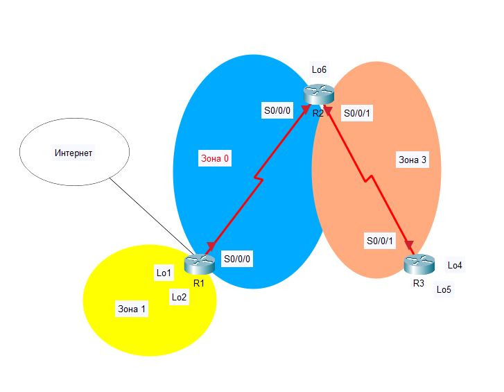

# Настройка OSPFv2 для нескольких областей

### Создание сети и настройка основных параметров устройства



Создадим сеть по заданной топологии и выполним базовые настройки маршрутизаторов.

```
Router>enable
Router#conf t
Enter configuration commands, one per line.  End with CNTL/Z.
Router(config)#hostname R1
R1(config)#line console 0
R1(config-line)#logging synchronous 
R1(config-line)#
R1#
%SYS-5-CONFIG_I: Configured from console by console

R1#conf t
Enter configuration commands, one per line.  End with CNTL/Z.
R1(config)#int loopback 0

R1(config-if)#
%LINK-5-CHANGED: Interface Loopback0, changed state to up

%LINEPROTO-5-UPDOWN: Line protocol on Interface Loopback0, changed state to up

R1(config-if)#ip address 209.165.200.225 255.255.255.252
R1(config-if)#no sh
R1(config-if)#exit

R1(config)#int loopback 1

%LINK-5-CHANGED: Interface Loopback1, changed state to up

%LINEPROTO-5-UPDOWN: Line protocol on Interface Loopback1, changed state to up

R1(config-if)#ip address 192.168.1.1 255.255.255.0
R1(config-if)#exit
R1(config)#int loopback 2

%LINK-5-CHANGED: Interface Loopback2, changed state to up

%LINEPROTO-5-UPDOWN: Line protocol on Interface Loopback2, changed state to up

R1(config-if)#ip address 192.168.2.1 255.255.255.0
R1(config-if)#exit
R1(config)#int s0/0/0
R1(config-if)#ip address 192.168.12.1 255.255.255.252
R1(config-if)#bandwidth 128
R1(config-if)#no shutdown

%LINK-5-CHANGED: Interface Serial0/0/0, changed state to down

R1(config-if)#

%SYS-5-CONFIG_I: Configured from console by console

R1#copy running-config startup-config 
Destination filename [startup-config]? 
Building configuration...
[OK]
```

```
Router>enable
Router#conf t
Enter configuration commands, one per line.  End with CNTL/Z.
Router(config)#hostname R2
R2(config)#line console 0
R2(config-line)#logging synchronous 
R2(config-line)#
R2(config)#int loopback 6

%LINK-5-CHANGED: Interface Loopback6, changed state to up

%LINEPROTO-5-UPDOWN: Line protocol on Interface Loopback6, changed state to up

R2(config-if)#ip address 192.168.6.1 255.255.255.0
R2(config-if)#exit
R2(config)#int s0/0/0
R2(config-if)#ip address 192.168.12.2 255.255.255.252
R2(config-if)#bandwidth 128
R2(config-if)#no shutdown

%LINK-5-CHANGED: Interface Serial0/0/0, changed state to up
%LINEPROTO-5-UPDOWN: Line protocol on Interface Serial0/0/0, changed state to up

R2(config)#int s0/0/1
R2(config-if)#clock rate 128000
R2(config-if)#ip address 192.168.23.1 255.255.255.252
R2(config-if)#bandwidth 128
R2(config-if)#no shutdown

%LINK-5-CHANGED: Interface Serial0/0/1, changed state to down

R2#copy running-config startup-config 
Destination filename [startup-config]? 
Building configuration...
[OK]
```

```
Router>enable
Router#conf t
Enter configuration commands, one per line.  End with CNTL/Z.
Router(config)#hostname R3
R3(config)#line console 0
R3(config-line)#logging synchronous 
R3(config-line)#exit
R3(config)#int loopback 4

%LINK-5-CHANGED: Interface Loopback4, changed state to up

%LINEPROTO-5-UPDOWN: Line protocol on Interface Loopback4, changed state to up

R3(config-if)#ip address 192.168.4.1 255.255.255.0
R3(config-if)#exit
R3(config)#int loopback 5

%LINK-5-CHANGED: Interface Loopback5, changed state to up

%LINEPROTO-5-UPDOWN: Line protocol on Interface Loopback5, changed state to up

R3(config-if)#ip address 192.168.5.1 255.255.255.0
R3(config-if)#exit
R3(config)#int s0/0/1
R3(config-if)#ip address 192.168.23.2 255.255.255.252
R3(config-if)#bandwidth 128
R3(config-if)#no sh

%LINK-5-CHANGED: Interface Serial0/0/1, changed state to up
%LINEPROTO-5-UPDOWN: Line protocol on Interface Serial0/0/1, changed state to up

R3#copy running-config startup-config 
Destination filename [startup-config]? 
Building configuration...
[OK]
```

Проверим наличие подключения на уровне 3. Выполним команду ``show ip interface brief``, чтобы убедиться в правильности IP-адресации и активности интерфейсов. Убедитесь, что каждый маршрутизатор может успешно отправлять эхо-запросы соседним маршрутизаторам, подключенным с помощью последовательных интерфейсов.

```
R1#show ip interface brief 
Interface              IP-Address      OK? Method Status                Protocol 
GigabitEthernet0/0     unassigned      YES unset  administratively down down 
GigabitEthernet0/1     unassigned      YES unset  administratively down down 
Serial0/0/0            192.168.12.1    YES manual up                    up 
Serial0/0/1            unassigned      YES unset  administratively down down 
Loopback0              209.165.200.225 YES manual up                    up 
Loopback1              192.168.1.1     YES manual up                    up 
Loopback2              192.168.2.1     YES manual up                    up 
Vlan1                  unassigned      YES unset  administratively down down
```

```
R2#show ip interface brief 
Interface              IP-Address      OK? Method Status                Protocol 
GigabitEthernet0/0     unassigned      YES unset  administratively down down 
GigabitEthernet0/1     unassigned      YES unset  administratively down down 
Serial0/0/0            192.168.12.2    YES manual up                    up 
Serial0/0/1            192.168.23.1    YES manual up                    up 
Loopback6              192.168.6.1     YES manual up                    up 
Vlan1                  unassigned      YES unset  administratively down down
```

```
R3#show ip interface brief
Interface              IP-Address      OK? Method Status                Protocol 
GigabitEthernet0/0     unassigned      YES unset  administratively down down 
GigabitEthernet0/1     unassigned      YES unset  administratively down down 
Serial0/0/0            unassigned      YES unset  administratively down down 
Serial0/0/1            192.168.23.2    YES manual up                    up 
Loopback4              192.168.4.1     YES manual up                    up 
Loopback5              192.168.5.1     YES manual up                    up 
Vlan1                  unassigned      YES unset  administratively down down
```

```
R1#ping 192.168.12.2

Type escape sequence to abort.
Sending 5, 100-byte ICMP Echos to 192.168.12.2, timeout is 2 seconds:
!!!!!
Success rate is 100 percent (5/5), round-trip min/avg/max = 1/1/3 ms
```

```
R2#ping 192.168.12.1

Type escape sequence to abort.
Sending 5, 100-byte ICMP Echos to 192.168.12.1, timeout is 2 seconds:
!!!!!
Success rate is 100 percent (5/5), round-trip min/avg/max = 1/3/11 ms

R2#ping 192.168.23.2

Type escape sequence to abort.
Sending 5, 100-byte ICMP Echos to 192.168.23.2, timeout is 2 seconds:
!!!!!
Success rate is 100 percent (5/5), round-trip min/avg/max = 1/4/13 ms
```

```
R3#ping 192.168.23.1

Type escape sequence to abort.
Sending 5, 100-byte ICMP Echos to 192.168.23.1, timeout is 2 seconds:
!!!!!
Success rate is 100 percent (5/5), round-trip min/avg/max = 1/2/8 ms
```


### Настройка сети OSPFv2 для нескольких областей

Определим типы маршрутизаторов OSPF:

Исходя из нашей топологии магистральными маршрутизаторами являются R1 и R2, т. к. принадлежат магистральной зоне 0. 

Граничным маршрутизатором автономной системы (ASBR) будет только R1, т. к. имеет подключение к внешней сети.

Граничными маршрутизаторами выступают R1 и R2 потому что они находятся в двух разных зонах.

Внутренним маршрутизатором будет являться R3, т. к. он принадлежит только зоне 3.

Теперь настроим протокол OSPF на маршрутизаторе R1. Для начала настроим идентификатор маршрутизатора 1.1.1.1 с идентификатором процесса OSPF 1

```
R1#conf t
Enter configuration commands, one per line.  End with CNTL/Z.
R1(config)#router ospf 1
R1(config-router)#router-id 1.1.1.1
```

Добавим OSPF для сетей маршрутизатора R1, кроме сети 209.165.200.0/24, т. к. данная сеть задана как внешняя.

```
R1(config-router)#network 192.168.1.0 0.0.0.255 area 1
R1(config-router)#network 192.168.2.0 0.0.0.255 area 1
R1(config-router)#network 192.168.12.0 0.0.0.3 area 0
```

Настроим все интерфейсы loopback локальной сети, Lo1 и Lo2, как пассивные.

```
R1(config-router)#passive-interface loopback 1
R1(config-router)#passive-interface loopback 2
R1(config-router)#exit
```

Создадим маршрут по умолчанию к сети Интернет, используя выходной интерфейс Lo0, и настроим для протокола OSPF распространение маршрутов в областях OSPF

```
R1(config)#ip route 0.0.0.0 0.0.0.0 loopback 0
%Default route without gateway, if not a point-to-point interface, may impact performance
R1(config)#router ospf 1
R1(config-router)#default-information originate 
```

Настроим протокол OSPF на маршрутизаторе R2. 

Настроим идентификатор маршрутизатора 2.2.2.2 с идентификатором процесса OSPF 1.

```
R2#conf t
Enter configuration commands, one per line.  End with CNTL/Z.
R2(config)#router ospf 1
R2(config-router)#router-id 2.2.2.2
```

Добавим OSPF для сетей маршрутизатора R2. Добавим сети в соответствующие области.

```
R2(config-router)#do show ip route connected
 C   192.168.6.0/24  is directly connected, Loopback6
 C   192.168.12.0/30  is directly connected, Serial0/0/0
 C   192.168.23.0/30  is directly connected, Serial0/0/1

R2(config-router)#network 192.168.6.0 0.0.0.255 area 3
R2(config-router)#network 192.168.12.0 0.0.0.3 area 0
01:03:29: %OSPF-5-ADJCHG: Process 1, Nbr 1.1.1.1 on Serial0/0/0 from LOADING to FULL, Loading Done

R2(config-router)#network 192.168.23.0 0.0.0.255 area 3
```

Настроим все интерфейсы loopback локальных сетей как пассивные.

```
R2(config-router)#passive-interface loopback 6
```

Настроим протокол OSPF на маршрутизаторе R3. Настроим идентификатор маршрутизатора 3.3.3.3 с идентификатором процесса OSPF 1.

```
R3#conf t
Enter configuration commands, one per line.  End with CNTL/Z.
R3(config)#router ospf 1
R3(config-router)#router-id 3.3.3.3
```

Добавим OSPF для сетей маршрутизатора R3.

```
R3(config-router)#do show ip route connected
 C   192.168.4.0/24  is directly connected, Loopback4
 C   192.168.5.0/24  is directly connected, Loopback5
 C   192.168.23.0/30  is directly connected, Serial0/0/1

R3(config-router)#network 192.168.4.0 0.0.0.255 area 3
R3(config-router)#network 192.168.5.0 0.0.0.255 area 3
R3(config-router)#network 192.168.23.0 0.0.0.3 area 3
```

Настройте все интерфейсы loopback локальных сетей как пассивные.

```
R3(config-router)#passive-interface loopback 4
R3(config-router)#passive-interface loopback 5
01:10:54: %OSPF-5-ADJCHG: Process 1, Nbr 2.2.2.2 on Serial0/0/1 from LOADING to FULL, Loading Done
```

Убедимся в правильности настройки протокола OSPF и в установлении отношений смежности между маршрутизаторами. Для этого на каждом маршрутизаторе выполним команду ``show ip protocols`` и посмотрим вывод.

```
R1#show ip protocols 

Routing Protocol is "ospf 1"
  Outgoing update filter list for all interfaces is not set 
  Incoming update filter list for all interfaces is not set 
  Router ID 1.1.1.1
  It is an autonomous system boundary router
  Redistributing External Routes from,
  Number of areas in this router is 2. 2 normal 0 stub 0 nssa
  Maximum path: 4
  Routing for Networks:
    192.168.1.0 0.0.0.255 area 1
    192.168.2.0 0.0.0.255 area 1
    192.168.12.0 0.0.0.3 area 0
  Passive Interface(s): 
    Loopback1
    Loopback2
  Routing Information Sources:  
    Gateway         Distance      Last Update 
    1.1.1.1              110      00:00:02
    2.2.2.2              110      00:00:02
  Distance: (default is 110)
```

```
R2#show ip protocols 

Routing Protocol is "ospf 1"
  Outgoing update filter list for all interfaces is not set 
  Incoming update filter list for all interfaces is not set 
  Router ID 2.2.2.2
  Number of areas in this router is 2. 2 normal 0 stub 0 nssa
  Maximum path: 4
  Routing for Networks:
    192.168.6.0 0.0.0.255 area 3
    192.168.23.0 0.0.0.255 area 3
    192.168.12.0 0.0.0.3 area 0
  Passive Interface(s): 
    Loopback6
  Routing Information Sources:  
    Gateway         Distance      Last Update 
    1.1.1.1              110      00:01:47
    2.2.2.2              110      00:01:47
    3.3.3.3              110      00:12:14
  Distance: (default is 110)
```

```
R3#show ip protocols 

Routing Protocol is "ospf 1"
  Outgoing update filter list for all interfaces is not set 
  Incoming update filter list for all interfaces is not set 
  Router ID 3.3.3.3
  Number of areas in this router is 1. 1 normal 0 stub 0 nssa
  Maximum path: 4
  Routing for Networks:
    192.168.4.0 0.0.0.255 area 3
    192.168.5.0 0.0.0.255 area 3
    192.168.23.0 0.0.0.3 area 3
  Passive Interface(s): 
    Loopback4
    Loopback5
  Routing Information Sources:  
    Gateway         Distance      Last Update 
    2.2.2.2              110      00:12:31
    3.3.3.3              110      00:12:31
  Distance: (default is 110)
```

Видим что маршрутизатор R1 относится к типу ABR и ASBR. Маршрутизатор R2 является ABR. R3 является внутренним маршрутизатором.

Убедимся в установлении отношений смежности OSPF между маршрутизаторами командой ``show ip ospf neighbor``

```
R1#show ip ospf neighbor 


Neighbor ID     Pri   State           Dead Time   Address         Interface
2.2.2.2           0   FULL/  -        00:00:38    192.168.12.2    Serial0/0/0
```

```
R2#show ip ospf neighbor 


Neighbor ID     Pri   State           Dead Time   Address         Interface
3.3.3.3           0   FULL/  -        00:00:32    192.168.23.2    Serial0/0/1
1.1.1.1           0   FULL/  -        00:00:36    192.168.12.1    Serial0/0/0
```

```
R3#show ip ospf neighbor 


Neighbor ID     Pri   State           Dead Time   Address         Interface
2.2.2.2           0   FULL/  -        00:00:32    192.168.23.1    Serial0/0/1
```

Посмотрим стоимость маршрутов.

```
R1#show ip ospf interface

Loopback1 is up, line protocol is up
  Internet address is 192.168.1.1/24, Area 1
  Process ID 1, Router ID 1.1.1.1, Network Type LOOPBACK, Cost: 1
  Loopback interface is treated as a stub Host
Loopback2 is up, line protocol is up
  Internet address is 192.168.2.1/24, Area 1
  Process ID 1, Router ID 1.1.1.1, Network Type LOOPBACK, Cost: 1
  Loopback interface is treated as a stub Host
Serial0/0/0 is up, line protocol is up
  Internet address is 192.168.12.1/30, Area 0
  Process ID 1, Router ID 1.1.1.1, Network Type POINT-TO-POINT, Cost: 781
  Transmit Delay is 1 sec, State POINT-TO-POINT,
  Timer intervals configured, Hello 10, Dead 40, Wait 40, Retransmit 5
    Hello due in 00:00:08
  Index 3/3, flood queue length 0
  Next 0x0(0)/0x0(0)
  Last flood scan length is 1, maximum is 1
  Last flood scan time is 0 msec, maximum is 0 msec
  Neighbor Count is 1 , Adjacent neighbor count is 1
    Adjacent with neighbor 2.2.2.2
  Suppress hello for 0 neighbor(s)
```

```
R2#show ip ospf interface 

Loopback6 is up, line protocol is up
  Internet address is 192.168.6.1/24, Area 3
  Process ID 1, Router ID 2.2.2.2, Network Type LOOPBACK, Cost: 1
  Loopback interface is treated as a stub Host
Serial0/0/1 is up, line protocol is up
  Internet address is 192.168.23.1/30, Area 3
  Process ID 1, Router ID 2.2.2.2, Network Type POINT-TO-POINT, Cost: 781
  Transmit Delay is 1 sec, State POINT-TO-POINT,
  Timer intervals configured, Hello 10, Dead 40, Wait 40, Retransmit 5
    Hello due in 00:00:00
  Index 2/2, flood queue length 0
  Next 0x0(0)/0x0(0)
  Last flood scan length is 1, maximum is 1
  Last flood scan time is 0 msec, maximum is 0 msec
  Neighbor Count is 1 , Adjacent neighbor count is 1
    Adjacent with neighbor 3.3.3.3
  Suppress hello for 0 neighbor(s)
Serial0/0/0 is up, line protocol is up
  Internet address is 192.168.12.2/30, Area 0
  Process ID 1, Router ID 2.2.2.2, Network Type POINT-TO-POINT, Cost: 781
  Transmit Delay is 1 sec, State POINT-TO-POINT,
  Timer intervals configured, Hello 10, Dead 40, Wait 40, Retransmit 5
    Hello due in 00:00:08
  Index 3/3, flood queue length 0
  Next 0x0(0)/0x0(0)
  Last flood scan length is 1, maximum is 1
  Last flood scan time is 0 msec, maximum is 0 msec
  Neighbor Count is 1 , Adjacent neighbor count is 1
    Adjacent with neighbor 1.1.1.1
  Suppress hello for 0 neighbor(s)
```

```
R3#show ip ospf interface 

Loopback4 is up, line protocol is up
  Internet address is 192.168.4.1/24, Area 3
  Process ID 1, Router ID 3.3.3.3, Network Type LOOPBACK, Cost: 1
  Loopback interface is treated as a stub Host
Loopback5 is up, line protocol is up
  Internet address is 192.168.5.1/24, Area 3
  Process ID 1, Router ID 3.3.3.3, Network Type LOOPBACK, Cost: 1
  Loopback interface is treated as a stub Host
Serial0/0/1 is up, line protocol is up
  Internet address is 192.168.23.2/30, Area 3
  Process ID 1, Router ID 3.3.3.3, Network Type POINT-TO-POINT, Cost: 781
  Transmit Delay is 1 sec, State POINT-TO-POINT,
  Timer intervals configured, Hello 10, Dead 40, Wait 40, Retransmit 5
    Hello due in 00:00:06
  Index 3/3, flood queue length 0
  Next 0x0(0)/0x0(0)
  Last flood scan length is 1, maximum is 1
  Last flood scan time is 0 msec, maximum is 0 msec
  Neighbor Count is 1 , Adjacent neighbor count is 1
    Adjacent with neighbor 2.2.2.2
  Suppress hello for 0 neighbor(s)
```

Настроим аутентификацию MD5 для OSPF на уровне интерфейса с ключом аутентификации Cisco123.

```
R1#conf t
Enter configuration commands, one per line.  End with CNTL/Z.
R1(config)#int s0/0/0
R1(config-if)#ip ospf message-digest-key 1 md5 Cisco123
R1(config-if)#ip ospf authentication message-digest 
```

```
R2#conf t
Enter configuration commands, one per line.  End with CNTL/Z.
R2(config)#int s0/0/0
R2(config-if)#ip ospf message-digest-key 1 md5 Cisco123
R2(config-if)#ip ospf authentication message-digest 

01:51:25: %OSPF-5-ADJCHG: Process 1, Nbr 1.1.1.1 on Serial0/0/0 from LOADING to FULL, Loading Done

R2(config-if)#int s0/0/1
R2(config-if)#ip ospf message-digest-key 1 md5 Cisco123
R2(config-if)#ip ospf authentication message-digest
```

```
R3#conf t
Enter configuration commands, one per line.  End with CNTL/Z.
R3(config)#int s0/0/1
R3(config-if)#ip ospf message-digest-key 1 md5 Cisco123
R3(config-if)#ip ospf authentication message-digest 
R3(config-if)#
01:53:26: %OSPF-5-ADJCHG: Process 1, Nbr 2.2.2.2 on Serial0/0/1 from LOADING to FULL, Loading Done
```

Перед настройкой аутентификации OSPF полезно проверить правильность работы OSPF, т. к. проще выполнять траблшутинг в последствии. Сразу будет понятно связана проблема с настройкой самого протокола либо с настройкой аутентификации.

Проверим восстановление отношений смежности OSPF и убедимся в восстановлении отношений смежности OSPF между маршрутизаторами после реализации аутентификации MD5.

```
R1#show ip ospf neighbor 

Neighbor ID     Pri   State           Dead Time   Address         Interface
2.2.2.2           0   FULL/  -        00:00:34    192.168.12.2    Serial0/0/0
```

```
R2#show ip ospf neighbor 

Neighbor ID     Pri   State           Dead Time   Address         Interface
3.3.3.3           0   FULL/  -        00:00:39    192.168.23.2    Serial0/0/1
1.1.1.1           0   FULL/  -        00:00:32    192.168.12.1    Serial0/0/0
```

```
R3#show ip ospf neighbor 

Neighbor ID     Pri   State           Dead Time   Address         Interface
2.2.2.2           0   FULL/  -        00:00:38    192.168.23.1    Serial0/0/1
```


### Настройка межобластных суммарных маршрутов

Просмотрим таблицы маршрутизации OSPF для всех маршрутизаторов.

```
R1#show ip route ospf
     192.168.4.0/32 is subnetted, 1 subnets
O IA    192.168.4.1 [110/1563] via 192.168.12.2, 00:09:03, Serial0/0/0
     192.168.5.0/32 is subnetted, 1 subnets
O IA    192.168.5.1 [110/1563] via 192.168.12.2, 00:09:03, Serial0/0/0
     192.168.6.0/32 is subnetted, 1 subnets
O IA    192.168.6.1 [110/782] via 192.168.12.2, 00:11:00, Serial0/0/0
     192.168.23.0/30 is subnetted, 1 subnets
O IA    192.168.23.0 [110/1562] via 192.168.12.2, 00:11:00, Serial0/0/0
```

```
R2#show ip route ospf 
     192.168.1.0/32 is subnetted, 1 subnets
O IA    192.168.1.1 [110/782] via 192.168.12.1, 00:12:04, Serial0/0/0
     192.168.2.0/32 is subnetted, 1 subnets
O IA    192.168.2.1 [110/782] via 192.168.12.1, 00:12:04, Serial0/0/0
     192.168.4.0/32 is subnetted, 1 subnets
O       192.168.4.1 [110/782] via 192.168.23.2, 00:10:12, Serial0/0/1
     192.168.5.0/32 is subnetted, 1 subnets
O       192.168.5.1 [110/782] via 192.168.23.2, 00:10:12, Serial0/0/1
O*E2 0.0.0.0/0 [110/1] via 192.168.12.1, 00:12:04, Serial0/0/0
```

```
R3#show ip route ospf
     192.168.1.0/32 is subnetted, 1 subnets
O IA    192.168.1.1 [110/1563] via 192.168.23.1, 00:10:36, Serial0/0/1
     192.168.2.0/32 is subnetted, 1 subnets
O IA    192.168.2.1 [110/1563] via 192.168.23.1, 00:10:36, Serial0/0/1
     192.168.6.0/32 is subnetted, 1 subnets
O       192.168.6.1 [110/782] via 192.168.23.1, 00:10:36, Serial0/0/1
     192.168.12.0/30 is subnetted, 1 subnets
O IA    192.168.12.0 [110/1562] via 192.168.23.1, 00:10:36, Serial0/0/1
O*E2 0.0.0.0/0 [110/1] via 192.168.23.1, 00:10:36, Serial0/0/1
```

Все маршруты с дескриптором O IA, означают межобластные маршруты.

Просмотрим базы данных LSDB на всех маршрутизаторах.

```
R1#show ip ospf database 
            OSPF Router with ID (1.1.1.1) (Process ID 1)

                Router Link States (Area 0)

Link ID         ADV Router      Age         Seq#       Checksum Link count
1.1.1.1         1.1.1.1         854         0x8000000c 0x0027f8 2
2.2.2.2         2.2.2.2         854         0x80000006 0x00cc56 2

                Summary Net Link States (Area 0)
Link ID         ADV Router      Age         Seq#       Checksum
192.168.1.1     1.1.1.1         996         0x80000005 0x00a644
192.168.2.1     1.1.1.1         996         0x80000006 0x00994f
192.168.4.1     2.2.2.2         737         0x80000009 0x00fcd2
192.168.5.1     2.2.2.2         737         0x8000000a 0x00efdd
192.168.6.1     2.2.2.2         120         0x8000000b 0x004596
192.168.23.0    2.2.2.2         95          0x8000000c 0x0013ab

                Router Link States (Area 1)

Link ID         ADV Router      Age         Seq#       Checksum Link count
1.1.1.1         1.1.1.1         859         0x80000007 0x0092c7 2

                Summary Net Link States (Area 1)
Link ID         ADV Router      Age         Seq#       Checksum
192.168.12.0    1.1.1.1         855         0x80000011 0x00a028
192.168.6.1     1.1.1.1         849         0x80000012 0x00f2d5
192.168.23.0    1.1.1.1         849         0x80000013 0x00c0ea
192.168.4.1     1.1.1.1         732         0x80000016 0x009e18
192.168.5.1     1.1.1.1         732         0x80000017 0x009123

                Type-5 AS External Link States
Link ID         ADV Router      Age         Seq#       Checksum Tag
0.0.0.0         1.1.1.1         868         0x80000002 0x00fcd0 1
```

```
R2#show ip ospf database 
            OSPF Router with ID (2.2.2.2) (Process ID 1)

                Router Link States (Area 0)

Link ID         ADV Router      Age         Seq#       Checksum Link count
2.2.2.2         2.2.2.2         885         0x80000006 0x00cc56 2
1.1.1.1         1.1.1.1         885         0x8000000c 0x0027f8 2

                Summary Net Link States (Area 0)
Link ID         ADV Router      Age         Seq#       Checksum
192.168.6.1     2.2.2.2         151         0x8000000b 0x004596
192.168.23.0    2.2.2.2         126         0x8000000c 0x0013ab
192.168.1.1     1.1.1.1         1027        0x80000005 0x00a644
192.168.2.1     1.1.1.1         1027        0x80000006 0x00994f
192.168.4.1     2.2.2.2         768         0x80000009 0x00fcd2
192.168.5.1     2.2.2.2         768         0x8000000a 0x00efdd

                Router Link States (Area 3)

Link ID         ADV Router      Age         Seq#       Checksum Link count
3.3.3.3         3.3.3.3         773         0x80000007 0x00d729 4
2.2.2.2         2.2.2.2         773         0x80000007 0x00d6ac 3

                Summary Net Link States (Area 3)
Link ID         ADV Router      Age         Seq#       Checksum
192.168.12.0    2.2.2.2         150         0x8000000c 0x008c3d
192.168.1.1     2.2.2.2         880         0x8000000a 0x001cb5
192.168.2.1     2.2.2.2         880         0x8000000b 0x000fc0

                Summary ASB Link States (Area 3)
Link ID         ADV Router      Age         Seq#       Checksum
1.1.1.1         2.2.2.2         880         0x80000009 0x009e9b

                Type-5 AS External Link States
Link ID         ADV Router      Age         Seq#       Checksum Tag
0.0.0.0         1.1.1.1         899         0x80000002 0x00fcd0 1
```

```
R3#show ip ospf database 
            OSPF Router with ID (3.3.3.3) (Process ID 1)

                Router Link States (Area 3)

Link ID         ADV Router      Age         Seq#       Checksum Link count
3.3.3.3         3.3.3.3         791         0x80000007 0x00d729 4
2.2.2.2         2.2.2.2         791         0x80000007 0x00d6ac 3

                Summary Net Link States (Area 3)
Link ID         ADV Router      Age         Seq#       Checksum
192.168.1.1     2.2.2.2         898         0x8000000a 0x001cb5
192.168.2.1     2.2.2.2         898         0x8000000b 0x000fc0
192.168.12.0    2.2.2.2         168         0x8000000c 0x008c3d

                Summary ASB Link States (Area 3)
Link ID         ADV Router      Age         Seq#       Checksum
1.1.1.1         2.2.2.2         898         0x80000009 0x009e9b

                Type-5 AS External Link States
Link ID         ADV Router      Age         Seq#       Checksum Tag
0.0.0.0         1.1.1.1         917         0x80000002 0x00fcd0 1
```

Рассчитаем и настроим суммарный маршрут для сетей в области 1 на маршрутизаторе R1.

```
R1#conf t
Enter configuration commands, one per line.  End with CNTL/Z.
R1(config)#router ospf 1
R1(config-router)#area 1 range 192.168.0.0 255.255.252.0
```

Суммарный маршрут для сетей в области 3 будет 192.168.4.0/22, т. к. в него будут входить все сети в области 3 (192.168.4.0/24, 192.168.5.0/24, 192.168.6.0/24). Настроим этот суммарный маршрут на роутере R2.

```
R2#conf t
Enter configuration commands, one per line.  End with CNTL/Z.
R2(config)#router ospf 1
R2(config-router)#area 3 range 192.168.4.0 255.255.252.0
```

Повторно отобразим таблицы маршрутизации OSPF для всех маршрутизаторов.

```
R1>show ip route ospf 
O IA 192.168.4.0 [110/782] via 192.168.12.2, 00:01:05, Serial0/0/0
     192.168.23.0/30 is subnetted, 1 subnets
O IA    192.168.23.0 [110/1562] via 192.168.12.2, 00:39:22, Serial0/0/0
```

```
R2#show ip route ospf 
O IA 192.168.0.0 [110/782] via 192.168.12.1, 00:14:59, Serial0/0/0
     192.168.4.0/32 is subnetted, 1 subnets
O       192.168.4.1 [110/782] via 192.168.23.2, 00:37:37, Serial0/0/1
     192.168.5.0/32 is subnetted, 1 subnets
O       192.168.5.1 [110/782] via 192.168.23.2, 00:37:37, Serial0/0/1
O*E2 0.0.0.0/0 [110/1] via 192.168.12.1, 00:39:29, Serial0/0/0
```

```
R3>show ip route ospf 
O IA 192.168.0.0 [110/1563] via 192.168.23.1, 00:15:00, Serial0/0/1
     192.168.6.0/32 is subnetted, 1 subnets
O       192.168.6.1 [110/782] via 192.168.23.1, 00:37:43, Serial0/0/1
     192.168.12.0/30 is subnetted, 1 subnets
O IA    192.168.12.0 [110/1562] via 192.168.23.1, 00:37:43, Serial0/0/1
O*E2 0.0.0.0/0 [110/1] via 192.168.23.1, 00:37:43, Serial0/0/1
```

Просмотрим базы данных LSDB на всех маршрутизаторах.

```
R1#show ip ospf database
            OSPF Router with ID (1.1.1.1) (Process ID 1)

                Router Link States (Area 0)

Link ID         ADV Router      Age         Seq#       Checksum Link count
1.1.1.1         1.1.1.1         836         0x8000000d 0x0025f9 2
2.2.2.2         2.2.2.2         837         0x80000007 0x00ca57 2

                Summary Net Link States (Area 0)
Link ID         ADV Router      Age         Seq#       Checksum
192.168.0.0     1.1.1.1         1172        0x80000007 0x00a845
192.168.4.0     2.2.2.2         348         0x8000000f 0x004e8f
192.168.23.0    2.2.2.2         78          0x80000010 0x000baf

                Router Link States (Area 1)

Link ID         ADV Router      Age         Seq#       Checksum Link count
1.1.1.1         1.1.1.1         841         0x80000008 0x0090c8 2

                Summary Net Link States (Area 1)
Link ID         ADV Router      Age         Seq#       Checksum
192.168.12.0    1.1.1.1         837         0x80000018 0x00922f
192.168.23.0    1.1.1.1         831         0x8000001a 0x00b2f1
192.168.4.0     1.1.1.1         343         0x8000001d 0x00edd5

                Type-5 AS External Link States
Link ID         ADV Router      Age         Seq#       Checksum Tag
0.0.0.0         1.1.1.1         850         0x80000003 0x00fad1 1
```

```
R2#show ip ospf database
            OSPF Router with ID (2.2.2.2) (Process ID 1)

                Router Link States (Area 0)

Link ID         ADV Router      Age         Seq#       Checksum Link count
2.2.2.2         2.2.2.2         1242        0x80000007 0x00ca57 2
1.1.1.1         1.1.1.1         1242        0x8000000d 0x0025f9 2

                Summary Net Link States (Area 0)
Link ID         ADV Router      Age         Seq#       Checksum
192.168.23.0    2.2.2.2         483         0x80000010 0x000baf
192.168.0.0     1.1.1.1         1578        0x80000007 0x00a845
192.168.4.0     2.2.2.2         754         0x8000000f 0x004e8f

                Router Link States (Area 3)

Link ID         ADV Router      Age         Seq#       Checksum Link count
2.2.2.2         2.2.2.2         1130        0x80000008 0x00d4ad 3
3.3.3.3         3.3.3.3         1130        0x80000008 0x00d629 4

                Summary Net Link States (Area 3)
Link ID         ADV Router      Age         Seq#       Checksum
192.168.12.0    2.2.2.2         507         0x8000000f 0x008640
192.168.0.0     2.2.2.2         1573        0x8000000d 0x001cb7

                Summary ASB Link States (Area 3)
Link ID         ADV Router      Age         Seq#       Checksum
1.1.1.1         2.2.2.2         1237        0x8000000e 0x0094a0

                Type-5 AS External Link States
Link ID         ADV Router      Age         Seq#       Checksum Tag
0.0.0.0         1.1.1.1         1257        0x80000003 0x00fad1 1
```

```
R3#show ip ospf database 
            OSPF Router with ID (3.3.3.3) (Process ID 1)

                Router Link States (Area 3)

Link ID         ADV Router      Age         Seq#       Checksum Link count
3.3.3.3         3.3.3.3         1156        0x80000008 0x00d629 4
2.2.2.2         2.2.2.2         1157        0x80000008 0x00d4ad 3

                Summary Net Link States (Area 3)
Link ID         ADV Router      Age         Seq#       Checksum
192.168.0.0     2.2.2.2         1599        0x8000000d 0x001cb7
192.168.12.0    2.2.2.2         533         0x8000000f 0x008640

                Summary ASB Link States (Area 3)
Link ID         ADV Router      Age         Seq#       Checksum
1.1.1.1         2.2.2.2         1263        0x8000000e 0x0094a0

                Type-5 AS External Link States
Link ID         ADV Router      Age         Seq#       Checksum Tag
0.0.0.0         1.1.1.1         1282        0x80000003 0x00fad1 1
```

Проверим наличие сквозного соединения.

```
R1>ping 192.168.5.1

Type escape sequence to abort.
Sending 5, 100-byte ICMP Echos to 192.168.5.1, timeout is 2 seconds:
!!!!!
Success rate is 100 percent (5/5), round-trip min/avg/max = 2/8/22 ms

R1>ping 192.168.4.1

Type escape sequence to abort.
Sending 5, 100-byte ICMP Echos to 192.168.4.1, timeout is 2 seconds:
!!!!!
Success rate is 100 percent (5/5), round-trip min/avg/max = 2/7/18 ms

R1>ping 192.168.6.1

Type escape sequence to abort.
Sending 5, 100-byte ICMP Echos to 192.168.6.1, timeout is 2 seconds:
!!!!!
Success rate is 100 percent (5/5), round-trip min/avg/max = 1/3/11 ms
```

```
R2#ping 192.168.1.1

Type escape sequence to abort.
Sending 5, 100-byte ICMP Echos to 192.168.1.1, timeout is 2 seconds:
!!!!!
Success rate is 100 percent (5/5), round-trip min/avg/max = 1/6/21 ms

R2#ping 192.168.2.1

Type escape sequence to abort.
Sending 5, 100-byte ICMP Echos to 192.168.2.1, timeout is 2 seconds:
!!!!!
Success rate is 100 percent (5/5), round-trip min/avg/max = 1/4/13 ms

R2#ping 192.168.4.1

Type escape sequence to abort.
Sending 5, 100-byte ICMP Echos to 192.168.4.1, timeout is 2 seconds:
!!!!!
Success rate is 100 percent (5/5), round-trip min/avg/max = 1/3/12 ms

R2#ping 192.168.5.1

Type escape sequence to abort.
Sending 5, 100-byte ICMP Echos to 192.168.5.1, timeout is 2 seconds:
!!!!!
Success rate is 100 percent (5/5), round-trip min/avg/max = 1/5/14 ms
```

```
R3#ping 192.168.1.1

Type escape sequence to abort.
Sending 5, 100-byte ICMP Echos to 192.168.1.1, timeout is 2 seconds:
!!!!!
Success rate is 100 percent (5/5), round-trip min/avg/max = 2/7/17 ms

R3#ping 192.168.2.1

Type escape sequence to abort.
Sending 5, 100-byte ICMP Echos to 192.168.2.1, timeout is 2 seconds:
!!!!!
Success rate is 100 percent (5/5), round-trip min/avg/max = 5/8/16 ms

R3#ping 192.168.6.1

Type escape sequence to abort.
Sending 5, 100-byte ICMP Echos to 192.168.6.1, timeout is 2 seconds:
!!!!!
Success rate is 100 percent (5/5), round-trip min/avg/max = 1/5/12 ms
```

### Вопросы для повторения

При проектировании сети протокол OSPF для нескольких областей предоставляет ряд преимуществ, среди которых: уменьшение частоты расчётов SPF, снижение объема обработки и нагрузки на память и сокращение накладных расходов на обновление состояний каналов.

Лабораторная работа выполнена с использованием Cisco Paket Tracer 7.3.0

1. [Лабораторная работа по теме "Настройка протокола OSPF для нескольких областей"](6.ma_ospfv2.pkt).